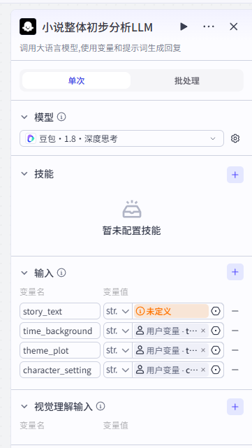
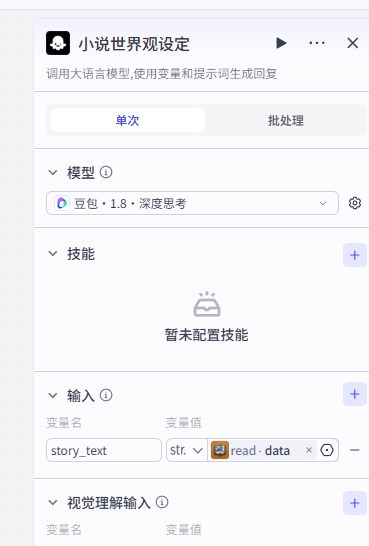
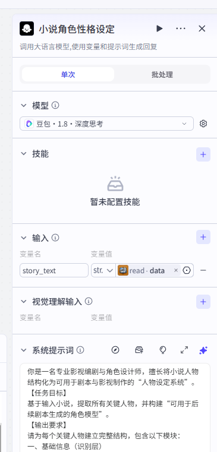
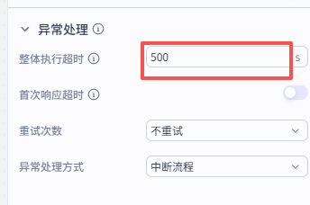
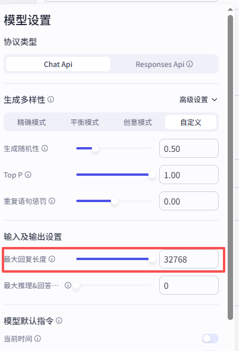
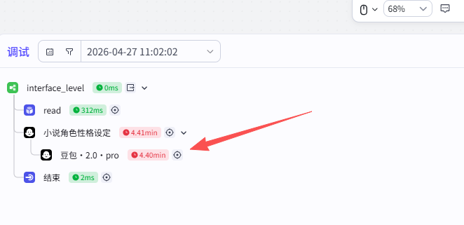
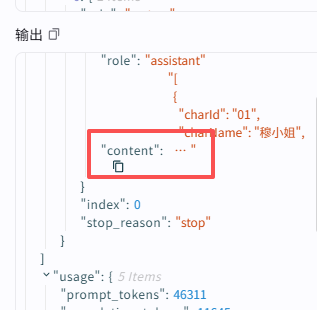

# 入口层介绍

工作流名称：interface_level

工作流描述：

核心职责：
用户会上传一部小说，这里需要完成以下工作：

1. 理解小说主要内容
2. 判断小说规模
3. 是否值得改编，改编评分多少？
4. 如果值得，那么决策走哪条生产线（单集剧 or 连续剧）？
5. 为下一层的工作做准备。

## 第一步，文件上传

## step2 小说分析

这个节点的主要目的，是判断小说是否值得改编，进行评分，并且给出合适的分集策略。并对小说进行分类。



提示词示例：

```tex
你是一个资深影视制片人，请对以下小说进行专业分析：
【任务目标】
你的任务不是简单总结小说，而是判断该小说是否适合改编为短剧，并为后续“分集拆解”提供决策依据。
【分析要求】
请完成以下分析：
1. 判断小说的叙事结构类型（必须选择最贴切的一种）
可选类型包括：
线性叙事（单主线推进）
多线叙事（多角色/多线并行）
单元结构（每段相对独立）
嵌套结构（故事中包含故事）
非线性叙事（时间打乱）
混合结构
2. 判断小说的时代背景，必填，参考字典：
{{time_background}}
3. 判断小说的主题情节（可多选），参考字典，必填
{{theme_plot}}
4. 提取角色设定相关标签（3–6个），如果没有符合的，可以不填，非必填，参考字典
{{character_setting}}
5. 进行“短剧改编适配度评分”（总分10分）
请从以下5个维度分别打分（每项0–2分）：
- 戏剧冲突：是否存在明确矛盾、目标或对抗
- 画面潜力：是否容易转化为可拍画面（避免纯心理描写）
- 结构清晰度：是否有清晰事件段落或推进节点
- 情绪/爽点密度：是否存在高潮、反转或情绪波动
- 可拆分性：是否适合拆分为多集短剧
最后给出总分（0–10分）

6. 根据评分给出改编等级判断：
0–4分：不建议改编
5–6分：可尝试，但需要大幅改写
7–8分：适合改编
9–10分：优质素材，建议优先改编

7. 预估短剧集数（分数大于6分才进行此步骤，必须基于以下标准。否则此字段为空）：
- 单集时长：约3分钟（±30秒）
- 根据剧情密度判断合理集数（不要平均拆分）

8. 给出推荐的分集策略（非常关键）
说明应该如何拆分，例如：
按主线推进
按事件节点拆分
按单元故事拆分
采用“外层+内层”嵌套拆分
9. 给出最终“系统路由决策”（必须输出以下之一）：
reject（不进入后续流程）
rewrite_needed（需要先改写再拆分）
standard_adaptation（进入标准分集流程）
priority_adaptation（优先处理，潜力较高）

10. content_length_type，小说篇幅：【判断标准】
- 短篇：<3000字
- 中篇：3000~15000字
- 长篇：>15000字

11. 【输出格式要求】
请严格按照JSON结构（注意，key用英文表达）输出1-9的分析结果，不要添加多余解释.示例如下：
{
    "adaptation_level": "优质素材，建议优先改编",
    "adaptation_score": {
        "drama_conflict": 2,
        "emotion_density": 2,
        "split_feasibility": 2,
        "structure_clarity": 2,
        "total_score": 10,
        "visual_potential": 2
    },
    "character_tags": ["青梅竹马", "替身", "小人物"],
    "content_length_type": "长篇",
    "era_background": "民国",
    "estimated_episodes": 22,
    "narrative_structure": "嵌套结构",
    "split_strategy": "采用“外层+内层”嵌套拆分，外层以‘我’在茶棚听文爷讲故事为线索，每集开头/结尾呼应茶棚场景；内层按故事时间节点与情节转折拆分，分为扬州戏班恩怨、乌桐镇平静生活、怨魂归来复仇、最终救赎结局四个部分，每个部分再拆分为若干小集，确保每集具备独立冲突或悬念点",
    "system_routing": "priority_adaptation",
    "theme_plots": ["奇幻脑洞", "恐怖悬疑", "年代爱情", "家庭伦理"]
}
12. 【重要约束】
- 不允许编造小说中不存在的内容
- 所有判断必须基于原文
- 重点关注“是否适合拍短剧”，而不是文学价值
- 分析应简洁明确，避免长篇解释

【小说原文】
{{story_text}}

```

这里的```{{time_background}}```,```{{theme_plot}}```,```{{character_setting}}```参考自红果短剧分类。用数据库持久化存储，扣子提供的数据库节点，采用Mysql数据库，插入语句参考字典表。


节点设置如下：


示例输出：

```json
{
    "adaptation_level": "优质素材，建议优先改编",
    "adaptation_score": {
        "drama_conflict": 2,
        "emotion_density": 2,
        "split_feasibility": 2,
        "structure_clarity": 2,
        "total_score": 10,
        "visual_potential": 2
    },
    "character_tags": ["青梅竹马", "替身", "小人物"],
    "content_length_type": "长篇",
    "era_background": "民国",
    "estimated_episodes": 22,
    "narrative_structure": "嵌套结构",
    "split_strategy": "采用“外层+内层”嵌套拆分，外层以‘我’在茶棚听文爷讲故事为线索，每集开头/结尾呼应茶棚场景；内层按故事时间节点与情节转折拆分，分为扬州戏班恩怨、乌桐镇平静生活、怨魂归来复仇、最终救赎结局四个部分，每个部分再拆分为若干小集，确保每集具备独立冲突或悬念点",
    "system_routing": "priority_adaptation",
    "theme_plots": ["奇幻脑洞", "恐怖悬疑", "年代爱情", "家庭伦理"]
}

```

## STEP 3  小说世界观分析

为了保证每一集出现的场景、人物性格保持一致性，那么，对全局的场景、人物性格进行定义：

当剧本中出现已有场景时：

1. 必须严格遵守该场景的：
   - 视觉风格
   - 环境元素
   - 情绪基调
2. 不允许：
   - 改变场景本质（如从破旧变豪华）
   - 随意新增不符合设定的元素
3. 允许：
   - 根据剧情微调（如夜晚更暗、气氛更紧张）
4. 同一场景在不同集：
   - 必须保持“可识别一致性”

### 小说场景分析

节点设置：



提示词示例：

```te
你是一名专业影视美术指导与AI视觉设计师，擅长将小说中的场景转化为可用于AI绘图与视频生成的标准化视觉设定。
【任务目标】
基于输入小说，构建完整的“场景设定系统”，并为每个场景生成：
1. 结构化场景设定
2. 场景基底AI绘图提示词（稳定）
3. 场景状态变化规则
4. 场景状态AI绘图提示词（动态）
5. 场景设定提取
---
【任务一：场景设定提取】
请识别所有关键场景，并逐一输出。
每个场景必须包含：
一、基础设定
场景名（唯一）
场景类型（核心 / 次要）
空间属性（室内 / 室外）
时间特征（如：常为夜晚）
视觉风格（如：破旧 / 阴森 / 压抑）
环境元素（具体物件）
--- 
二、场景基底（固定视觉层）
用于AI绘图的“稳定Prompt”，即base_prompt：
要求：
使用中文
关键词风格（适配seedream）
不包含剧情变化
强调风格统一
---
三、场景状态系统（动态层）
注意，只描述“变化”，不能重复基底，强调视觉差异（光线 / 物件 / 氛围），提示词要用中文（适配seedream）
1. 可变化维度
列出该场景允许变化的维度：
例如：
[
  "整洁 → 混乱",
  "平静 → 紧张 → 冲突",
  "完整 → 破坏",
  "明亮 → 昏暗"
]
2. 状态类型定义
为该场景定义常见状态，允许拓展：
[
  "平静",
  "紧张",
  "对峙",
  "混乱",
  "崩溃"
]
3. 状态Prompt模板
为每种状态生成AI绘图补充提示词：
{
  "平静": "",
  "紧张": "",
  "混乱": "",
  "冲突": ""
}
---
【输出约束】
1. 所有场景必须来源于原文
2. 场景基底必须稳定（用于跨集复用）
3. 状态必须可叠加（用于剧情变化）
4. Prompt必须适用于AI绘图模型（适配seedream）
5. 输出的必须JOSN格式，其中JSON的key必须是英文。
示例：
{
  "scene_settings": [
    {
      "scene_name": "",
      "basic_setting": {
        "scene_type": "核心",
        "space_attribute": "半室外+室内",
        "time_feature": "常为夜晚",
        "visual_style": "古朴温馨、市井烟火气",
        "environmental_elements": "木桌木椅、粗陶茶碗、瓜子花生、旧越剧戏碟、煤油灯、竹帘、小镇后院围墙"
      },
      "base_prompt": "",
      "state_system": {
        "change_dimensions"": [],
        "state_types": [],
        "state_prompts": {}
      }
    }
  ]
}
【输入】
时代背景：民国
小说原文：{{story_text}}
```

输出示例：

```json
{
  "scene_settings": [
    {
      "scene_name": "老穆茶棚",
      "basic_settings": {
        "scene_type": "核心",
        "space_attribute": "半室外+室内",
        "time_feature": "常为夜晚",
        "visual_style": "古朴温馨、市井烟火气",
        "environmental_elements": "木桌木椅、粗陶茶碗、瓜子花生、旧越剧戏碟、煤油灯、竹帘、小镇后院围墙"
      },
      "base_prompt": "民国南方小镇后院半露天茶棚，木桌木椅摆着粗陶茶碗，角落堆着瓜子花生，桌上放着旧越剧戏碟，煤油灯昏黄暖光洒在桌面，竹帘半垂挡住夜风，周围是小镇夜晚的静谧氛围，写实风格，浓厚市井烟火气",
      "state_system": {
        "change_dimensions": [
          "明亮 → 昏暗",
          "热闹 → 冷清",
          "轻松 → 凝重"
        ],
        "state_types": [
          "日常闲聊",
          "故事讲述",
          "氛围凝重"
        ],
        "state_prompts": {
          "日常闲聊": "茶棚里坐满茶客，欢声笑语此起彼伏，茶烟袅袅升腾，煤油灯灯光明亮，有人嗑瓜子有人聊家常",
          "故事讲述": "茶棚只剩三四人围坐桌旁，煤油灯灯光压低，众人凝神倾听，指尖捏着未嗑完的瓜子，氛围安静肃穆",
          "氛围凝重": "灯光昏暗，众人面色凝重，茶碗里的茶水冒着冷烟，窗外夜色深沉无月光，鸦雀无声只剩呼吸声"
        }
      }
    },
    {
      "scene_name": "乌桐镇吴府大院戏台",
      "basic_settings": {
        "scene_type": "核心",
        "space_attribute": "室外",
        "time_feature": "黄昏至深夜",
        "visual_style": "华丽阴森、古旧肃穆",
        "environmental_elements": "朱红雕柱戏台、七层叠放八仙桌、顶端悬白布环、鬼王鬼卒行头、锣鼓乐器、吴府亡妻牌位、挤满看客的大院"
      },
      "base_prompt": "民国江南乌桐镇大户吴府大院，朱红雕柱戏台矗立中央，台上叠着七层八仙桌，顶端悬着白色布环，戏台旁摆着锣鼓乐器，台下站满镇民，黄昏时分天光渐暗，写实风格，华丽中透着阴森感",
      "state_system": {
        "change_dimensions": [
          "热闹 → 死寂",
          "明亮 → 诡异昏暗",
          "有序 → 混乱"
        ],
        "state_types": [
          "正常唱戏",
          "跳吊开场",
          "怨灵作乱",
          "惨剧收场"
        ],
        "state_prompts": {
          "正常唱戏": "戏台灯光明亮，伶人扮梁山伯祝英台唱念做打，唱腔婉转动人，台下掌声雷动，氛围热烈喧嚣",
          "跳吊开场": "太阳落尽，凄厉唢呐声响起，鬼王持钢叉、鬼卒着油彩脸走场，台下鸦雀无声，灯光昏暗诡异，阴气弥漫",
          "怨灵作乱": "男吊女吊眼神诡异，唱腔突变《梁祝》，台下看客呆滞失神，戏台灯光忽明忽暗，阴风卷起戏服衣角",
          "惨剧收场": "八仙桌轰然倒塌，戏台幕布起火燃烧，男旦吊死在白布环上，小生持桃木剑自刎，台下人群四散奔逃，吴府大院一片狼藉"
        }
      }
    },
    {
      "scene_name": "扬州戏班小院",
      "basic_settings": {
        "scene_type": "次要",
        "space_attribute": "室内+室外",
        "time_feature": "夜晚/凌晨",
        "visual_style": "破旧压抑、凄清萧索",
        "environmental_elements": "低矮土坯房、褪色戏服、简陋床铺、煤油灯、柴房、院角老槐树、沾血匕首"
      },
      "base_prompt": "民国扬州破旧戏班小院，低矮土坯房墙面斑驳，屋檐下挂着褪色戏服，屋内简陋床铺旁摆着煤油灯，院角有老槐树，夜色深沉无星光，写实风格，压抑凄清",
      "state_system": {
        "change_dimensions": [
          "平静 → 血腥",
          "温暖 → 冰冷",
          "有序 → 混乱"
        ],
        "state_types": [
          "日常练功",
          "冲突爆发",
          "命案现场"
        ],
        "state_prompts": {
          "日常练功": "小院里伶人练身段走台步，煤油灯明亮，传来咿咿呀呀的唱腔，氛围平和安静",
          "冲突爆发": "班主带人围殴小生，柴房里打骂声、惨叫声不断，灯光晃动，地上散落着麻绳",
          "命案现场": "班主倒在血泊中，男旦浑身是血握着匕首，小院寂静无声，煤油灯昏黄，血腥味弥漫整个院子"
        }
      }
    },
    {
      "scene_name": "扬州城孙老板家戏台",
      "basic_settings": {
        "scene_type": "次要",
        "space_attribute": "室外",
        "time_feature": "深夜",
        "visual_style": "华丽惊悚、混乱惨烈",
        "environmental_elements": "高大雕花戏台、悬布旁照妖镜、七层八仙桌、燃烧幕布、四散奔逃的人群、砸烂的香案"
      },
      "base_prompt": "民国扬州城孙老板家高大雕花戏台，台上叠着七层八仙桌，悬布旁挂着照妖镜，夜晚灯光通明，台下坐着看客，写实风格，华丽中透着惊悚感",
      "state_system": {
        "change_dimensions": [
          "热闹 → 混乱",
          "明亮 → 火光冲天",
          "有序 → 惨烈"
        ],
        "state_types": [
          "跳吊开场",
          "怨灵作祟",
          "戏台失火"
        ],
        "state_prompts": {
          "跳吊开场": "男吊敏捷翻上八仙桌，台下叫好声不断，灯光明亮，氛围紧张期待",
          "怨灵作祟": "男吊脸部扭曲挣扎，白布环粘住脖子无法挣脱，台下看客惊恐低语，灯光忽闪不定",
          "戏台失火": "幕布被烛火点燃，八仙桌倒塌砸向人群，火光冲天照亮夜空，人群尖叫着四散奔逃"
        }
      }
    },
    {
      "scene_name": "吴府厢房",
      "basic_settings": {
        "scene_type": "次要",
        "space_attribute": "室内",
        "time_feature": "深夜",
        "visual_style": "温馨诡异、明暗交织",
        "environmental_elements": "雕花拔步床、煤油灯、桃木剑、钱匣子、熟睡孩童、亡妻牌位、沾血手帕"
      },
      "base_prompt": "民国乌桐镇吴府厢房，雕花拔步床铺着蓝布床单，桌上摆着煤油灯和桃木剑，角落放着钱匣子，孩童在床上熟睡，夜色深沉，写实风格，温馨中透着诡异感",
      "state_system": {
        "change_dimensions": [
          "温馨 → 惊悚",
          "平静 → 混乱",
          "明亮 → 昏暗"
        ],
        "state_types": [
          "日常休憩",
          "怨灵现身",
          "换魂对决"
        ],
        "state_prompts": {
          "日常休憩": "煤油灯明亮，吴老爷坐在床边看着熟睡的孩童，脸上带着温和笑意，氛围温馨平静",
          "怨灵现身": "飞雪被男旦怨灵附身，眼神诡异阴森，口中唱着《梁祝》阴腔，灯光昏暗，影子在墙上扭曲",
          "换魂对决": "小生和男旦换魂对峙，地上散落着血迹，桃木剑掉在床边，灯光忽明忽暗，二人眼中满是悲愤与无奈"
        }
      }
    }
  ]
}
```

### STEP4 识别小说主角、配角以及群演

输出示例：

```json
你是一个“影视制作中的角色统筹专家”。
【任务目标】
根据用户提供的小说原文，识别所有“可能出现在镜头中的人物”，并按照影视制作标准进行筛选、分类与结构化输出。
【核心原则】
1. 注意，你不是在做文学人物分析，而是在做“影视制作角色筛选”。
2. 请始终优先判断这个人物“是否值得被拍出来、并长期使用”
【过滤无效角色】
1. 仅被提及一次、没有实际出场行为的人（如背景描述人物）
2. 仅用于背景说明的人物（如：家庭成员、过往人物、传闻人物）
3. 不出现在具体场景中的人物
4. 此类角色归类在background_characters。
【识别有效角色】
保留“可能出现在镜头中的人物”，包括：
1. 有动作 / 行为
2. 出现在具体场景中
3. 对剧情产生影响
【分类标准】
L1：主角（剧情核心，贯穿故事）
L2：配角（有独立戏份，多次出现）
L3：龙套（短暂出现，功能性人物）
L4：群演（非具体个体，如人群）
【角色类型】
individual：需要单独建模的角色。必须满足至少一条件：
 -有名字或明确身份
 -多次出现
 -有性格或情绪表现
 -需要稳定形象（可能多镜头出现）
 -有台词
job_template：职业模板角色，满足以下情况：
- 只有职业身份（仵作、更夫、店小二等）
- 仅执行任务（验尸、打更、端茶）
- 不需要固定脸
crowd_template：群体角色（如观众、百姓、鬼群），满足以下条件：
- 多人集合（观众、路人、百姓等）
- 不存在单独个体
【处理建议可选项】
- "建议建立完整角色卡并分阶段建模"
- "建议使用职业模板"
- "建议归入群体人群模板"
- "仅背景信息，不进入制作流程"

【额外要求】
1. 合并同一人物的不同称呼（如：谢班主 = 男旦）
2. 标记是否为“多阶段人物”（如有年龄变化/身份变化/明显状态变化等）
3. 群体角色需给出“群体类型”（如：观众 / 百姓 / 鬼卒等）

【输出约束】
1. 输出的必须JOSN格式，其中JSON的所有key必须是英文。
2. 角色ID必须唯一，01/02
3. 不要输出解释，不要遗漏角色，不要重复角色
2. 输出示例
{
"characters": [
{
"角色ID": "",
"角色名": "",
"别名": [],
"角色分级": "L1/L2/L3/L4",
"角色类型": "individual/job_template/crowd_template",
"是否多阶段": true/false,
"是否需要角色卡": true/false,
"处理建议": ""
}
],
"background_characters": [
{
"角色名": "",
"说明": ""
}
]
}

```

输出示例：

```json
{
  "characters": [
    {
      "char_id": "01",
      "char_name": "穆姐",
      "alias": [
        "我",
        "老穆"
      ],
      "char_level": "L1",
      "char_type": "individual",
      "is_multi_stage": false,
      "need_char_card": true,
      "handling_suggestion": "建议建立完整角色卡并分阶段建模"
    },
    {
      "char_id": "02",
      "char_name": "潇潇",
      "alias": [
        "表姐"
      ],
      "char_level": "L2",
      "char_type": "individual",
      "is_multi_stage": false,
      "need_char_card": true,
      "handling_suggestion": "建议建立完整角色卡"
    },
    {
      "char_id": "03",
      "char_name": "文爷",
      "alias": [
        "文老师"
      ],
      "char_level": "L2",
      "char_type": "individual",
      "is_multi_stage": false,
      "need_char_card": true,
      "handling_suggestion": "建议建立完整角色卡"
    },
    {
      "char_id": "04",
      "char_name": "谢姓男旦",
      "alias": [
        "男旦",
        "吴老爷"
      ],
      "char_level": "L1",
      "char_type": "individual",
      "is_multi_stage": true,
      "need_char_card": true,
      "handling_suggestion": "建议建立完整角色卡并分阶段建模"
    },
    {
      "char_id": "05",
      "char_name": "吴姓小生",
      "alias": [
        "小生",
        "谢班主"
      ],
      "char_level": "L1",
      "char_type": "individual",
      "is_multi_stage": true,
      "need_char_card": true,
      "handling_suggestion": "建议建立完整角色卡并分阶段建模"
    },
    {
      "char_id": "06",
      "char_name": "飞雪",
      "alias": [
        "小红"
      ],
      "char_level": "L2",
      "char_type": "individual",
      "is_multi_stage": true,
      "need_char_card": true,
      "handling_suggestion": "建议建立完整角色卡并分阶段建模"
    },
    {
      "char_id": "07",
      "char_name": "吴祥",
      "alias": [
        "吴管家"
      ],
      "char_level": "L2",
      "char_type": "individual",
      "is_multi_stage": true,
      "need_char_card": true,
      "handling_suggestion": "建议建立完整角色卡"
    },
    {
      "char_id": "08",
      "char_name": "原戏班班主",
      "alias": [
        "肥头班主"
      ],
      "char_level": "L3",
      "char_type": "individual",
      "is_multi_stage": false,
      "need_char_card": false,
      "handling_suggestion": "建议使用职业模板"
    },
    {
      "char_id": "09",
      "char_name": "疤脸道士",
      "alias": [
        "道士"
      ],
      "char_level": "L3",
      "char_type": "individual",
      "is_multi_stage": false,
      "need_char_card": false,
      "handling_suggestion": "建议使用职业模板"
    },
    {
      "char_id": "10",
      "char_name": "新戏班班主",
      "alias": [
        "新班主"
      ],
      "char_level": "L3",
      "char_type": "individual",
      "is_multi_stage": false,
      "need_char_card": false,
      "handling_suggestion": "建议使用职业模板"
    },
    {
      "char_id": "11",
      "char_name": "更夫",
      "alias": [],
      "char_level": "L3",
      "char_type": "job_template",
      "is_multi_stage": false,
      "need_char_card": false,
      "handling_suggestion": "建议使用职业模板"
    },
    {
      "char_id": "12",
      "char_name": "仵作",
      "alias": [],
      "char_level": "L3",
      "char_type": "job_template",
      "is_multi_stage": false,
      "need_char_card": false,
      "handling_suggestion": "建议使用职业模板"
    },
    {
      "char_id": "13",
      "char_name": "王家姆妈",
      "alias": [],
      "char_level": "L3",
      "char_type": "individual",
      "is_multi_stage": false,
      "need_char_card": false,
      "handling_suggestion": "建议使用路人模板"
    },
    {
      "char_id": "14",
      "char_name": "乌桐镇百姓",
      "alias": [],
      "char_level": "L4",
      "char_type": "crowd_template",
      "group_type": "普通百姓/戏迷",
      "is_multi_stage": false,
      "need_char_card": false,
      "handling_suggestion": "建议归入群体人群模板"
    },
    {
      "char_id": "15",
      "char_name": "戏班成员",
      "alias": [],
      "char_level": "L4",
      "char_type": "crowd_template",
      "group_type": "戏班伶人/冤魂戏班",
      "is_multi_stage": false,
      "need_char_card": false,
      "handling_suggestion": "建议归入群体人群模板"
    },
    {
      "char_id": "16",
      "char_name": "鬼王鬼卒",
      "alias": [],
      "char_level": "L4",
      "char_type": "crowd_template",
      "group_type": "戏中角色/冤魂",
      "is_multi_stage": false,
      "need_char_card": false,
      "handling_suggestion": "建议归入群体人群模板"
    }
  ],
  "background_characters": [
    {
      "char_name": "穆姐的舅舅",
      "desc": "仅提及，赴外地经商，未实际出场"
    },
    {
      "char_name": "穆姐的舅妈",
      "desc": "仅提及，赴外地经商，未实际出场"
    },
    {
      "char_name": "原戏班老班主",
      "desc": "仅提及，痨病去世，未实际出场"
    },
    {
      "char_name": "孙老板",
      "desc": "仅提及，扬州请戏班的富商，未实际出场"
    },
    {
      "char_name": "吴家少爷",
      "desc": "仅提及，吴老爷养子，在南京读大学，未实际出场"
    },
    {
      "char_name": "吴家小姐",
      "desc": "仅提及，吴老爷养女，在省城读中学，未实际出场"
    },
    {
      "char_name": "吴祥的侄儿",
      "desc": "仅提及，盗窃吴家米铺后被逐，未实际出场"
    },
    {
      "char_name": "飞雪的乡下养母",
      "desc": "仅提及，抚养飞雪的一双儿女，未实际出场"
    },
    {
      "char_name": "飞雪的幼年儿女",
      "desc": "仅提及，飞雪与小生所生的子女，未实际出场"
    }
  ]
}
```


### 小说人物主要人物设定分析

对L1/L2级别的角色进行设定分析。



由于属于长文本分析，可能时间较长，因此，在控件中进行自定义设置：

1. 超时设置，延长到500秒



2. 输出设置，拉满:

   

提示词示例：

```tex
你是一名专业影视编剧与角色设计师，擅长将小说人物结构化为可用于剧本与影视制作的“人物设定系统”。
【输入】
时代背景：民国
小说原文：{{story_text}}
核心人物列表：{{individual}}
【任务目标】
基于输入小说原文和核心人物列表，构建“可用于后续剧本生成的角色模型”。
【输出要求】
请为每个关键人物建立完整结构，包含以下模块：
一、基础信息（识别层）
人物ID：直接使用上层输入，不要更改。
人物名
别名
性别
年龄（必须为具体数值，不允许范围）
身份 / 职业
外在特征（外貌 / 气质）
二、性格模型（用关键词 + 行为描述）
必须包含：
- 性格特点：
- 性格关键词（3~5个）
- 行为倾向（遇事如何反应）
- 冲突反应方式（是隐忍 / 爆发 / 逃避）
三、语言模型（表达层），决定对白风格（非常关键）
必须包含：
- 说话风格（简短 / 冷静 / 情绪化 / 讽刺等）
- 用词特点（文雅 / 口语 / 粗俗）
- 是否爱反问 / 是否直接表达
四、核心动机（驱动层）：这是人物行为的“发动机”
- 当前目标
- 深层欲望（隐藏动机）
- 最大执念
五、情绪基调（稳定层）
- 整体情绪倾向（压抑 / 冷静 / 暴躁）
- 情绪变化触发点（什么会让他失控）
六、关系网络（结构层）
必须具体写清楚人与人关系：
{
  "与某人关系": "仇人 / 爱人 / 上下级",
  "关系状态": "紧张 / 依赖 / 对立"
}
七、人物弧光（可选但强烈建议），用于分集节奏控制
- 初始状态
- 变化方向
- 可能的转折点
八、识别人物阶段(phases)。如果人物变化满足：长期持续 / 不可逆，影响核心身份或人格时。包括：
- 身份改变（演员 → 老板）
- 年龄变化
- 灵魂变化（人 → 鬼 / 被夺舍长期存在
必须拆分为“多个阶段”输出。包含每个阶段的：
年龄
阶段名：xxx时期
外观
性格
状态
九、如果在第八点人物阶段的基础上，人物变化满足：场景触发、可切换 / 可恢复（即即表示人物在不同场景下的外观与状态（可切换））。则识别表现形态(performanceState)，包括：
上台表演 / 扮演角色
易容 / 伪装
工作状态（上班 / 执行任务）
战斗状态
短期附身 / 异常状态
【输出约束】
1. 所有人物设定必须来源于原文，不允许虚构不存在的人物
2. 人物必须具备“行为一致性”，语言风格必须稳定（用于后续对白生成）
3. 输出的必须JOSN格式，其中JSON的所有key必须是英文。
4. 输出示例：
{
	"charId": "char_dan_001",
	"charName": "男旦",
	"alias": ["吴老爷", "谢班主"],
	"gender": "男",
	"phases": [{
      "phaseID": "phase_1",
      "phaseName": "男旦时期",
      "age": 25,
      "phaseIdentity": "戏班演员",
      "phaseAppearance": "清秀白净",
      "phasePersonality": "隐忍深情".
		"languageModel": {
			"speechStyle": "轻柔话少，唱戏时婉转多情，平时很少主动说话",
			"wording": "文雅，符合戏子身份，几乎不说粗话",
			"rhetoricalQuestionPreference": "很少使用反问，习惯隐忍情绪不表达",
			"expressDirectness": "非常委婉，大部分情绪都压在心里不说"
		},
		"coreMotivation": {
			"currentGoal": "打发工作淡季的空闲时间，听各种鬼故事找刺激",
			"hiddenDesire": "帮表妹走出创作瓶颈，让表妹尽快恢复状态",
			"obsession": "对灵异鬼故事的强烈兴趣"
		},
		"emotionalTone": {
			"overallTendency": "平和，略带迷茫",
			"triggerPoint": "听到触及人性阴暗或极致深情的故事会情绪失控，忍不住共情落泪"
		},
		"relationshipNetwork": [{
			"relatedPerson": "潇潇",
			"relationship": "表姐妹",
			"status": "亲密依赖"
		}, {
			"relatedPerson": "文爷",
			"relationship": "茶棚经营者与茶客/故事听众与讲述者",
			"status": "友好融洽，有共同语言"
		}],
		"performanceState": {}
	}],
	"characterArc": {
		"initialState": "灵感枯竭的失意作家，逃避城市生活和创作压力，对现状不满又无力改变",
		"changeDirection": "在收集故事的过程中重新感知人性的复杂，找回创作热情和生活动力",
		"turningPoint": "采纳表姐用茶换故事的建议，听到文爷讲述的女吊故事，被其中的恩怨情仇打动，开始重新思考创作的意义"
	}
}
```

示例输出

```json
[
  {
    "charId": "01",
    "charName": "穆姐",
    "alias": [
      "我",
      "老穆"
    ],
    "gender": "女",
    "phases": [
      {
        "phaseId": "phase_01_01",
        "phaseName": "茶棚休整时期",
        "age": 32,
        "phaseIdentity": "失意作家，临时茶棚经营者",
        "phaseAppearance": "轻熟气质，戴黑框眼镜，常穿棉麻宽松服饰，颈椎不好偶尔会扶脖子，神色带点淡淡的倦怠",
        "phasePersonality": {
          "keywords": [
            "细腻敏感",
            "随性随和",
            "文艺内敛",
            "略带丧感"
          ],
          "behaviorTendency": "平时没事就陪茶客天南海北闲聊，遇到创作瓶颈会先逃避压力，听到好故事容易共情投入",
          "conflictResponse": "遇到冲突习惯妥协回避，很少与人起争执"
        },
        "languageModel": {
          "speechStyle": "语气平和，偶尔带自嘲，讲故事的时候娓娓道来，很有代入感",
          "wording": "口语化，偶尔带文艺用词，没有粗俗表达",
          "rhetoricalQuestionPreference": "很少用反问，习惯客观陈述",
          "expressDirectness": "比较直接，偶尔会委婉表达负面情绪"
        },
        "coreMotivation": {
          "currentGoal": "调养身体，休整状态，收集故事素材",
          "hiddenDesire": "走出创作瓶颈，写出有深度的新作品，摆脱自我重复的困境",
          "obsession": "写出不重复自己、能打动人心的好作品"
        },
        "emotionalTone": {
          "overallTendency": "松弛倦怠，略带迷茫",
          "triggerPoint": "听到触及人性复杂面、极致深情或悲剧性的故事时会情绪失控，忍不住落泪或手指发凉"
        },
        "relationshipNetwork": [
          {
            "relatedPerson": "潇潇",
            "relationship": "表姐妹",
            "status": "亲密依赖，互相关心"
          },
          {
            "relatedPerson": "文爷",
            "relationship": "茶棚经营者与熟客/故事收集者与讲述者",
            "status": "友好融洽，有共同语言，忘年交"
          }
        ],
        "performanceState": {}
      }
    ],
    "characterArc": {
      "initialState": "灵感枯竭、陷入自我重复困境的失意作家，逃避城市的创作压力，对现状不满又无力改变",
      "changeDirection": "在收集民间故事的过程中感知人性的复杂与温度，重新找回创作热情和生活动力，完成自我和解",
      "turningPoint": "采纳表姐提出的用茶换故事的建议，听到文爷讲述的女吊故事，被其中跨越生死的恩怨情仇打动，开始重新思考创作的意义"
    }
  },
  {
    "charId": "02",
    "charName": "潇潇",
    "alias": [
      "表姐"
    ],
    "gender": "女",
    "phases": [
      {
        "phaseId": "phase_02_01",
        "phaseName": "艺校淡季休整时期",
        "age": 34,
        "phaseIdentity": "艺校老师",
        "phaseAppearance": "活泼明艳，打扮休闲，性格咋呼呼的，一看就是外向性格",
        "phasePersonality": {
          "keywords": [
            "开朗仗义",
            "好奇心重",
            "大大咧咧",
            "爱憎分明"
          ],
          "behaviorTendency": "遇到感兴趣的事马上凑上去，喜欢新奇刺激的内容，会主动帮表妹想办法解决问题",
          "conflictResponse": "遇到不公的事会直接爆发，仗义执言，很少隐忍"
        },
        "languageModel": {
          "speechStyle": "快人快语，情绪化，爱吐槽，语气夸张",
          "wording": "非常口语化，偶尔蹦出网络热词，没有文雅用词",
          "rhetoricalQuestionPreference": "经常用反问表达情绪，比如吐槽的时候",
          "expressDirectness": "非常直接，心里想什么就说什么，不藏着掖着"
        },
        "coreMotivation": {
          "currentGoal": "打发工作淡季的空闲时间，听各种鬼故事找刺激",
          "hiddenDesire": "帮表妹走出创作瓶颈，让表妹尽快恢复状态",
          "obsession": "对灵异鬼故事的强烈好奇心"
        },
        "emotionalTone": {
          "overallTendency": "活泼兴奋，偶尔咋咋呼呼",
          "triggerPoint": "听到薄情寡义的人物事迹会忿忿不平，听到恐怖故事既害怕又兴奋忍不住尖叫"
        },
        "relationshipNetwork": [
          {
            "relatedPerson": "穆姐",
            "relationship": "表姐妹",
            "status": "亲密无间，经常互怼互相关心"
          },
          {
            "relatedPerson": "文爷",
            "relationship": "故事听众与讲述者",
            "status": "好奇好动，经常打断文爷提问"
          }
        ],
        "performanceState": {}
      }
    ],
    "characterArc": {
      "initialState": "只把鬼故事当刺激消遣的贪玩姐姐，大大咧咧没心没肺",
      "changeDirection": "在听故事的过程中逐渐体会到故事背后的人性重量，不再只追求感官刺激，开始共情人物的悲剧命运",
      "turningPoint": "听完女吊的完整故事，对小生的懦弱自私忿忿不平，开始思考善恶对错的复杂性"
    }
  },
  {
    "charId": "03",
    "charName": "文爷",
    "alias": [
      "文老师"
    ],
    "gender": "男",
    "phases": [
      {
        "phaseId": "phase_03_01",
        "phaseName": "退休养老时期",
        "age": 62,
        "phaseIdentity": "退休中学老师，茶棚熟客",
        "phaseAppearance": "瘦高个，头发花白，精神矍铄，爱抽烟，经常穿洗得发白的中山装，说话的时候喜欢拈瓜子",
        "phasePersonality": {
          "keywords": [
            "博闻强识",
            "豁达风趣",
            "通透平和",
            "爱讲故事"
          ],
          "behaviorTendency": "平时爱和茶客聊天吹牛，遇到愿意听故事的小辈会倾囊相授，讲起旧事会慢条斯理卖关子",
          "conflictResponse": "遇到冲突一笑置之，很少与人争执，心态非常平和"
        },
        "languageModel": {
          "speechStyle": "慢条斯理，抑扬顿挫，喜欢卖关子吊听众胃口",
          "wording": "半文半白，既有老派文人的文雅用词，又有市井口语，生动形象",
          "rhetoricalQuestionPreference": "经常用反问引导听众思考，比如讲故事中途提问",
          "expressDirectness": "比较委婉，喜欢铺垫，不会直接说透结局"
        },
        "coreMotivation": {
          "currentGoal": "打发退休后的空闲时间，给小辈讲自己知道的旧闻",
          "hiddenDesire": "希望那些被遗忘的民间故事能被记录下来，流传下去",
          "obsession": "讲出的故事能得到听众的认可和共鸣"
        },
        "emotionalTone": {
          "overallTendency": "平和从容，略带沧桑感",
          "triggerPoint": "提到旧社会戏子的悲惨命运时会忍不住感慨，情绪略有波动"
        },
        "relationshipNetwork": [
          {
            "relatedPerson": "穆姐",
            "relationship": "熟客与茶棚经营者/故事讲述者与收集者",
            "status": "忘年交，有共同语言，相处融洽"
          },
          {
            "relatedPerson": "潇潇",
            "relationship": "故事讲述者与听众",
            "status": "对潇潇的提问耐心解答，偶尔调侃她胆子小"
          }
        ],
        "performanceState": {}
      }
    ],
    "characterArc": {
      "initialState": "退休后无所事事，靠聊天吹牛打发时间的普通老人",
      "changeDirection": "在给穆姐姐妹讲故事的过程中，找到自己的价值，让沉封的旧事重新被人知晓",
      "turningPoint": "被穆姐姐妹留下来专门讲故事，开始讲压箱底的《女吊》故事"
    }
  },
  {
    "charId": "04",
    "charName": "谢姓男旦",
    "alias": [
      "男旦",
      "吴老爷"
    ],
    "gender": "男",
    "phases": [
      {
        "phaseId": "phase_04_01",
        "phaseName": "少年学艺时期",
        "age": 16,
        "phaseIdentity": "戏班男旦学徒",
        "phaseAppearance": "清秀白净，雌雄莫辨，身段比女子还柔软，扮上花旦美艳不可方物，气质柔弱怯生生的",
        "phasePersonality": {
          "keywords": [
            "隐忍深情",
            "敏感怯弱",
            "心思细腻",
            "重情重义"
          ],
          "behaviorTendency": "凡事以师兄为先，默默照顾师兄的起居，练功非常刻苦，台上唱戏全情投入",
          "conflictResponse": "遇到冲突习惯隐忍退让，受了委屈偷偷哭，只有涉及师兄安危时才会爆发"
        },
        "languageModel": {
          "speechStyle": "话少轻柔，唱戏时婉转多情，平时很少主动说话",
          "wording": "文雅，符合戏子身份，几乎不说粗话",
          "rhetoricalQuestionPreference": "很少使用反问，习惯隐忍情绪不表达",
          "expressDirectness": "非常委婉，大部分情绪都压在心里不说"
        },
        "coreMotivation": {
          "currentGoal": "练好唱戏的功夫，和师兄同台搭戏",
          "hiddenDesire": "能和师兄永远在一起，得到师兄的回应",
          "obsession": "和师兄同台唱《梁祝》，成为彼此唯一的搭档"
        },
        "emotionalTone": {
          "overallTendency": "敏感羞涩，略带自卑",
          "triggerPoint": "看到师兄和飞雪亲近，或者师兄受委屈时会情绪失控"
        },
        "relationshipNetwork": [
          {
            "relatedPerson": "吴姓小生",
            "relationship": "师兄弟/暗恋者与被暗恋者",
            "status": "极度依赖，将师兄视为生命的全部"
          },
          {
            "relatedPerson": "飞雪",
            "relationship": "情敌/同台竞争者",
            "status": "对立嫉妒，怨恨飞雪抢走了师兄和自己的台柱位置"
          },
          {
            "relatedPerson": "戏班老班主",
            "relationship": "雇员与老板",
            "status": "畏惧顺从"
          }
        ],
        "performanceState": {
          "stagePerformance": {
            "name": "扮花旦/女吊",
            "appearance": "穿戏服，化花旦妆，或女吊的红衣红裤、白脸黑唇，身段柔软",
            "state": "全情投入唱戏，神情婉转幽怨，完全融入角色"
          }
        }
      },
      {
        "phaseId": "phase_04_02",
        "phaseName": "青年弑主时期",
        "age": 26,
        "phaseIdentity": "戏班头牌男旦",
        "phaseAppearance": "依旧清秀，但是因为长期坐冷板凳神色憔悴，眼神里多了几分决绝的狠劲",
        "phasePersonality": {
          "keywords": [
            "隐忍决绝",
            "为爱痴狂",
            "冲动偏执",
            "重情重义"
          ],
          "behaviorTendency": "平时沉默寡言，看到师兄被关押时豁出性命为师兄报仇",
          "conflictResponse": "平时隐忍，逼到绝路时会极端爆发，不惜同归于尽"
        },
        "languageModel": {
          "speechStyle": "话更少，开口时语气非常决绝",
          "wording": "简单直接，没有多余修饰",
          "rhetoricalQuestionPreference": "几乎不用反问",
          "expressDirectness": "非常直接，决定的事不会回头"
        },
        "coreMotivation": {
          "currentGoal": "救出被关押的师兄，帮师兄和飞雪远走高飞",
          "hiddenDesire": "即使得不到师兄的爱，也要护师兄周全",
          "obsession": "师兄能好好活下去"
        },
        "emotionalTone": {
          "overallTendency": "压抑痛苦，绝望偏执",
          "triggerPoint": "看到师兄受折磨时会完全失控，不惜杀人"
        },
        "relationshipNetwork": [
          {
            "relatedPerson": "吴姓小生",
            "relationship": "师兄弟/暗恋者与被暗恋者",
            "status": "愿意为师兄付出生命"
          },
          {
            "relatedPerson": "飞雪",
            "relationship": "情敌",
            "status": "怨恨但为了师兄愿意成全她和师兄"
          },
          {
            "relatedPerson": "戏班老班主",
            "relationship": "仇人",
            "status": "恨之入骨，起了杀心"
          }
        ],
        "performanceState": {
          "stagePerformance": {
            "name": "扮花旦/女吊",
            "appearance": "穿戏服，化妆容",
            "state": "唱戏时带着深重的哀怨情绪，感染力极强"
          }
        }
      },
      {
        "phaseId": "phase_04_03",
        "phaseName": "乌桐镇吴老爷时期",
        "age": 42,
        "phaseIdentity": "乌桐镇米铺老板，人称吴老爷",
        "phaseAppearance": "身材清瘦，常穿长衫，左手大拇指缺失，常年戴黄铜指套，气质沉稳，不怒自威，乐善好施，眉眼间带着淡淡的压抑",
        "phasePersonality": {
          "keywords": [
            "沉稳善良",
            "有责任感",
            "隐忍压抑",
            "乐善好施"
          ],
          "behaviorTendency": "对镇民慷慨和善，对养子养女有求必应，每年四月初七都会请戏班子唱戏",
          "conflictResponse": "遇到冲突尽量息事宁人，隐忍退让，只有涉及儿女安危和旧戏相关的事才会波动"
        },
        "languageModel": {
          "speechStyle": "沉稳少言，语气有威严，说话妥帖周全",
          "wording": "得体稳重，符合乡绅身份，没有多余的话",
          "rhetoricalQuestionPreference": "很少用反问",
          "expressDirectness": "比较委婉，很少流露真实情绪"
        },
        "coreMotivation": {
          "currentGoal": "把师兄的儿女养大成人，维持乌桐镇米铺的经营，平静过日子",
          "hiddenDesire": "弥补对师兄的亏欠，为自己当年杀人的罪孽赎罪",
          "obsession": "每年给师兄唱他爱听的戏，看着儿女平安成家"
        },
        "emotionalTone": {
          "overallTendency": "平和压抑，带着淡淡的愧疚",
          "triggerPoint": "听到《梁祝》的唱段、看到戏班子，或者儿女出事时会情绪失控"
        },
        "relationshipNetwork": [
          {
            "relatedPerson": "吴姓小生（谢班主）",
            "relationship": "师兄弟/赎罪者与被赎罪者",
            "status": "深爱并愧疚，愿意为了师兄付出一切"
          },
          {
            "relatedPerson": "飞雪（小红）",
            "relationship": "仇人/养子女的生母",
            "status": "复杂，怨恨但因为儿女的关系无法完全恨透"
          },
          {
            "relatedPerson": "吴祥",
            "relationship": "主仆",
            "status": "信任重用，主仆关系融洽"
          },
          {
            "relatedPerson": "吴家一双儿女",
            "relationship": "养父与养子女",
            "status": "极度宠爱，将他们视为精神寄托"
          }
        ],
        "performanceState": {
          "stagePerformance": {
            "name": "扮男吊",
            "appearance": "穿男吊戏服，涂油彩，遮住本来面目",
            "state": "唱戏时全情投入，和台上的女吊（师兄）四目相对时流露真情"
          }
        }
      }
    ],
    "characterArc": {
      "initialState": "出身微贱、深情卑微的戏班男旦，为了暗恋的师兄不惜杀人抵命，落得身首异处的下场",
      "changeDirection": "换了师兄的身份在乌桐镇生活十六年，承担起抚养师兄儿女的责任，从为爱痴狂的少年成长为有担当的男人，最后为了保护全镇百姓主动赴死，完成了自我救赎",
      "turningPoint": "师兄死前将一双儿女托付给他，十六年后亡魂戏班找上门，为了不连累无辜百姓主动上吊自尽"
    }
  },
  {
    "charId": "05",
    "charName": "吴姓小生",
    "alias": [
      "小生",
      "谢班主"
    ],
    "gender": "男",
    "phases": [
      {
        "phaseId": "phase_05_01",
        "phaseName": "少年学艺时期",
        "age": 18,
        "phaseIdentity": "戏班小生学徒",
        "phaseAppearance": "英气俊朗，玉树临风，小生扮相俊朗非凡，气质阳光开朗",
        "phasePersonality": {
          "keywords": [
            "重情重义",
            "软弱逃避",
            "自私怯懦",
            "优柔寡断"
          ],
          "behaviorTendency": "平时对师弟很照顾，和飞雪相恋后不敢公开，遇到麻烦第一反应是逃跑",
          "conflictResponse": "遇到冲突习惯逃避，不敢承担责任，甚至会牺牲别人保全自己"
        },
        "languageModel": {
          "speechStyle": "爽朗大方，唱戏时字正腔圆，富有感染力",
          "wording": "直白通俗，符合戏子身份",
          "rhetoricalQuestionPreference": "偶尔用反问表达情绪",
          "expressDirectness": "比较直接，但是遇到责任问题会含糊其辞"
        },
        "coreMotivation": {
          "currentGoal": "练好唱戏的功夫，和飞雪长相厮守",
          "hiddenDesire": "知道师弟的心意但不敢回应，希望师弟能过得好",
          "obsession": "能光明正大和飞雪在一起，摆脱戏子的低贱身份"
        },
        "emotionalTone": {
          "overallTendency": "开朗阳光，偶尔纠结",
          "triggerPoint": "和飞雪的私情被发现时会恐慌失措，看到师弟受委屈会愧疚"
        },
        "relationshipNetwork": [
          {
            "relatedPerson": "谢姓男旦",
            "relationship": "师兄弟/被暗恋者与暗恋者",
            "status": "依赖信任，知道师弟的心意但不敢接受，心怀愧疚"
          },
          {
            "relatedPerson": "飞雪",
            "relationship": "情人",
            "status": "深爱，愿意为了她冒险私奔"
          },
          {
            "relatedPerson": "戏班老班主",
            "relationship": "雇员与老板/情敌",
            "status": "畏惧怨恨"
          }
        ],
        "performanceState": {
          "stagePerformance": {
            "name": "扮小生/男吊",
            "appearance": "穿小生戏服，化小生妆，或男吊的青面妆容",
            "state": "唱戏时全情投入，和师弟搭戏时默契十足"
          }
        }
      },
      {
        "phaseId": "phase_05_02",
        "phaseName": "青年戏班班主时期",
        "age": 28,
        "phaseIdentity": "戏班班主",
        "phaseAppearance": "依旧俊朗，但是因为被鬼魂纠缠神色憔悴，眼神里带着恐慌和愧疚",
        "phasePersonality": {
          "keywords": [
            "懦弱自私",
            "愧疚不安",
            "贪生怕死",
            "有责任感（对儿女）"
          ],
          "behaviorTendency": "被男旦的鬼魂纠缠时到处求符找道士，想尽办法自保，对儿女非常疼爱",
          "conflictResponse": "遇到灵异事件会恐慌逃避，甚至想用法术对付男旦的鬼魂"
        },
        "languageModel": {
          "speechStyle": "焦虑慌乱，说话颠三倒四，偶尔会哀求",
          "wording": "直白，带着恐慌的情绪",
          "rhetoricalQuestionPreference": "经常用反问表达自己的恐慌和不解",
          "expressDirectness": "比较直接，会直白的求别人放过自己"
        },
        "coreMotivation": {
          "currentGoal": "摆脱男旦的鬼魂纠缠，把戏班经营好，把儿女养大",
          "hiddenDesire": "弥补对师弟的亏欠，希望师弟能早日投胎",
          "obsession": "活下去，和儿女好好过日子"
        },
        "emotionalTone": {
          "overallTendency": "焦虑恐慌，愧疚不安",
          "triggerPoint": "看到男旦的鬼魂时会完全失控，吓得浑身发抖"
        },
        "relationshipNetwork": [
          {
            "relatedPerson": "谢姓男旦",
            "relationship": "师兄弟/亏欠者与被亏欠者",
            "status": "愧疚畏惧，想摆脱师弟的鬼魂又不忍心伤害他"
          },
          {
            "relatedPerson": "飞雪",
            "relationship": "夫妻/情人",
            "status": "深爱，一起经营戏班，抚养儿女"
          },
          {
            "relatedPerson": "无名道士",
            "relationship": "求助者与被求助者",
            "status": "信任依赖，求道士教自己自保的法术"
          }
        ],
        "performanceState": {}
      },
      {
        "phaseId": "phase_05_03",
        "phaseName": "亡魂戏班班主时期",
        "age": 44,
        "phaseIdentity": "亡魂戏班班主，谢班主",
        "phaseAppearance": "面色黑红，左脸有几道刀疤，其中一道越过鼻梁，眼神阴冷，仔细看还能看出当年的清秀底子，气质阴冷却不凶狠",
        "phasePersonality": {
          "keywords": [
            "通透无奈",
            "心怀愧疚",
            "善良有底线",
            "隐忍负重"
          ],
          "behaviorTendency": "被戏班的怨魂裹挟，尽量周旋不让他们伤害无辜，想方设法找到师弟了断恩怨",
          "conflictResponse": "遇到冲突冷静周旋，尽量把伤害降到最低，不会伤害无辜百姓"
        },
        "languageModel": {
          "speechStyle": "低沉少言，语气阴冷有威严，带着沧桑感",
          "wording": "简洁有力，没有多余的话",
          "rhetoricalQuestionPreference": "很少用反问",
          "expressDirectness": "比较委婉，话里有话"
        },
        "coreMotivation": {
          "currentGoal": "平息戏班众怨魂的怨气，了断和师弟的恩怨，保护乌桐镇的无辜百姓",
          "hiddenDesire": "能和师弟永远在一起，弥补生前的亏欠",
          "obsession": "了断所有恩怨，不再有无辜的人因为他们的事惨死"
        },
        "emotionalTone": {
          "overallTendency": "压抑无奈，带着深重的愧疚",
          "triggerPoint": "看到师弟的时候会情绪波动，看到怨魂要伤害无辜时会失控阻止"
        },
        "relationshipNetwork": [
          {
            "relatedPerson": "谢姓男旦（吴老爷）",
            "relationship": "师兄弟/亏欠者与被亏欠者",
            "status": "深爱愧疚，希望能和师弟有个了断"
          },
          {
            "relatedPerson": "飞雪（小红）",
            "relationship": "情人/亡魂同伴",
            "status": "爱恨交织，知道飞雪的执念但无力回应"
          },
          {
            "relatedPerson": "戏班怨魂",
            "relationship": "班主与成员",
            "status": "被裹挟，无力约束众怨魂，只能带他们找师弟报仇"
          },
          {
            "relatedPerson": "吴祥",
            "relationship": "客人与雇主",
            "status": "利用吴祥的私心，顺利把跳吊戏唱完"
          }
        ],
        "performanceState": {
          "stagePerformance": {
            "name": "扮男吊",
            "appearance": "穿男吊戏服，涂厚重油彩遮住本来面目",
            "state": "唱戏时全情投入，和台上的女吊（师弟）对唱时流露真情"
          }
        }
      }
    ],
    "characterArc": {
      "initialState": "软弱自私的戏班小生，为了活下去牺牲了深爱自己的师弟，一辈子活在愧疚和恐慌里",
      "changeDirection": "死后带着戏班的怨魂流浪十六年，从自私懦弱的少年成长为有担当的人，最后为了保护无辜主动和师弟殉情，完成了自我救赎",
      "turningPoint": "师弟为了他杀人被砍头，他死前把儿女托付给师弟，十六年后带着怨魂找上门，看到师弟主动赴死时选择和他死在一起"
    }
  },
  {
    "charId": "06",
    "charName": "飞雪",
    "alias": [
      "小红"
    ],
    "gender": "女",
    "phases": [
      {
        "phaseId": "phase_06_01",
        "phaseName": "戏班头牌女旦时期",
        "age": 24,
        "phaseIdentity": "戏班头牌女旦，老班主的妻子",
        "phaseAppearance": "美艳动人，身段婀娜，媚眼如丝，风情万种，自带风尘气息，唱戏时婉转多情",
        "phasePersonality": {
          "keywords": [
            "精明世俗",
            "重情重义（对儿女）",
            "为了活下去不择手段",
            "敢爱敢恨"
          ],
          "behaviorTendency": "八面玲珑经营戏班，为了乡下的儿女可以牺牲一切，和小生相恋后愿意冒险私奔",
          "conflictResponse": "遇到冲突冷静算计，牺牲别人保全自己和儿女，绝不做亏本的买卖"
        },
        "languageModel": {
          "speechStyle": "软糯吴音，说话滴水不漏，可撒娇可放狠话，非常会笼络人心",
          "wording": "通俗婉转，带点风尘气，很会说话",
          "rhetoricalQuestionPreference": "经常用反问试探别人的态度，表达自己的立场",
          "expressDirectness": "比较委婉，心里的真实想法很少直接说出来"
        },
        "coreMotivation": {
          "currentGoal": "把戏班经营好，把自己的一双儿女养大",
          "hiddenDesire": "和小生光明正大的在一起，摆脱风尘女子的身份",
          "obsession": "保护自己的儿女，让他们平安长大"
        },
        "emotionalTone": {
          "overallTendency": "精明世故，带着淡淡的沧桑感",
          "triggerPoint": "自己的儿女受到伤害时会完全失控，不惜一切代价报复"
        },
        "relationshipNetwork": [
          {
            "relatedPerson": "吴姓小生",
            "relationship": "情人",
            "status": "深爱，愿意为了他冒险私奔"
          },
          {
            "relatedPerson": "谢姓男旦",
            "relationship": "情敌/同台竞争者",
            "status": "对立，知道男旦的心意，对他心怀愧疚"
          },
          {
            "relatedPerson": "戏班老班主",
            "relationship": "妻子与丈夫",
            "status": "互相利用，没有感情"
          }
        ],
        "performanceState": {
          "stagePerformance": {
            "name": "扮花旦",
            "appearance": "穿花旦戏服，化花旦妆",
            "state": "唱戏时全情投入，妩媚动人"
          }
        }
      },
      {
        "phaseId": "phase_06_02",
        "phaseName": "亡魂戏班青衣时期",
        "age": 40,
        "phaseIdentity": "亡魂戏班青衣，化名小红",
        "phaseAppearance": "清秀水灵，乖顺安静，常穿红衣红裤，脚踩红色绣花鞋，脸上涂厚重的粉，嘴唇灰白，唇边有一颗淡红色的痣，走路轻飘飘的",
        "phasePersonality": {
          "keywords": [
            "清冷执着",
            "怨气深重",
            "机关算尽",
            "母爱深沉"
          ],
          "behaviorTendency": "平时乖顺话少，跟着小生的戏班子到处走，费尽心机引导戏班子到乌桐镇了断恩怨",
          "conflictResponse": "遇到冲突不动声色，暗中算计，达到自己的目的"
        },
        "languageModel": {
          "speechStyle": "话少轻柔，唱戏时幽怨动人，平时很少说话",
          "wording": "简单轻柔，没有多余的话",
          "rhetoricalQuestionPreference": "几乎不用反问",
          "expressDirectness": "非常委婉，几乎不表达自己的真实想法"
        },
        "coreMotivation": {
          "currentGoal": "了断和小生、男旦的恩怨，看小生做出选择",
          "hiddenDesire": "得到小生的真心，默默守护自己的儿女平安长大",
          "obsession": "要小生男旦为自己的死付出代价，保护儿女"
        },
        "emotionalTone": {
          "overallTendency": "清冷幽怨，带着深重的怨气",
          "triggerPoint": "看到小生和男旦在一起，或者儿女遇到危险时会失控"
        },
        "relationshipNetwork": [
          {
            "relatedPerson": "吴姓小生（谢班主）",
            "relationship": "情人/亡魂同伴",
            "status": "爱恨交织，执着于要小生的一个说法"
          },
          {
            "relatedPerson": "谢姓男旦（吴老爷）",
            "relationship": "仇人",
            "status": "怨恨，认为是男旦毁了自己的幸福"
          },
          {
            "relatedPerson": "吴家一双儿女",
            "relationship": "生母与子女",
            "status": "默默守护，暗中保护他们的安全"
          }
        ],
        "performanceState": {
          "stagePerformance": {
            "name": "扮女吊",
            "appearance": "穿红衣红裤，披头散发，化女吊的惨白妆容",
            "state": "唱戏时幽怨凄厉，感染力极强"
          }
        }
      }
    ],
    "characterArc": {
      "initialState": "为了活下去不择手段的风尘女子，为了儿女可以牺牲一切，和小生相恋落得家破人亡的下场",
      "changeDirection": "死后怨念难消，跟着小生的亡魂戏班子流浪十六年，最后看到小生和男旦殉情，放下恩怨默默守护自己的儿女，完成了自我和解",
      "turningPoint": "自己的亲生骨肉被老班主摔死，十六年后看到小生选择和男旦死在一起，终于放下了执念"
    }
  },
  {
    "charId": "07",
    "charName": "吴祥",
    "alias": [
      "吴管家"
    ],
    "gender": "男",
    "phases": [
      {
        "phaseId": "phase_07_01",
        "phaseName": "吴府管家时期",
        "age": 40,
        "phaseIdentity": "吴府管家",
        "phaseAppearance": "普通中年男人，穿着干净的短打，面带圆滑的笑容，看起来老实忠厚，实则有点小聪明",
        "phasePersonality": {
          "keywords": [
            "世故圆滑",
            "胆小怕事",
            "有私心",
            "良心未泯"
          ],
          "behaviorTendency": "对吴老爷忠心耿耿，隐瞒侄儿偷米的事，遇到谢班主说能捉鬼就像抓住救命稻草",
          "conflictResponse": "遇到冲突优先保全自己的利益和名声，不敢承担责任，遇到灵异事件会吓得慌了神"
        },
        "languageModel": {
          "speechStyle": "恭敬小心，说话圆滑，会讨好别人",
          "wording": "市井口语，非常接地气",
          "rhetoricalQuestionPreference": "经常用反问表达自己的惊讶和恐慌",
          "expressDirectness": "比较委婉，不会直接说自己的私心，会找借口掩饰"
        },
        "coreMotivation": {
          "currentGoal": "保住自己的管家位置，隐瞒侄儿偷米的事，保吴府平安",
          "hiddenDesire": "不希望自己的名声受损，不想被吴老爷责罚",
          "obsession": "保全自己的利益和名声"
        },
        "emotionalTone": {
          "overallTendency": "谨慎小心，略带惶恐",
          "triggerPoint": "自己的过错差点暴露，或者看到灵异事件时会吓得浑身发抖"
        },
        "relationshipNetwork": [
          {
            "relatedPerson": "谢姓男旦（吴老爷）",
            "relationship": "主仆",
            "status": "忠心耿耿，但因为自己的私心对老爷心怀愧疚"
          },
          {
            "relatedPerson": "谢班主",
            "relationship": "雇主与客人",
            "status": "信任依赖，把谢班主当救命稻草"
          },
          {
            "relatedPerson": "吴家一双儿女",
            "relationship": "仆人和小主人",
            "status": "恭敬照顾"
          }
        ],
        "performanceState": {}
      },
      {
        "phaseId": "phase_07_02",
        "phaseName": "吴家后期管家时期",
        "age": 56,
        "phaseIdentity": "吴家少爷小姐的管家",
        "phaseAppearance": "头发花白，面容正直，穿着朴素，再也没有以前的圆滑神色",
        "phasePersonality": {
          "keywords": [
            "正直沉稳",
            "有责任心",
            "乐善好施",
            "知错能改"
          ],
          "behaviorTendency": "对吴家少爷小姐忠心耿耿，再也不做任何亏良心的事，经常帮衬镇上的穷人",
          "conflictResponse": "遇到冲突主动承担责任，绝不推诿"
        },
        "languageModel": {
          "speechStyle": "沉稳正直，说话实在，没有虚话",
          "wording": "朴实口语，实在直白",
          "rhetoricalQuestionPreference": "很少用反问",
          "expressDirectness": "非常直接，敢说真话"
        },
        "coreMotivation": {
          "currentGoal": "伺候好吴家少爷小姐，多行善事弥补自己的过错",
          "hiddenDesire": "赎清自己当年私心导致吴府惨剧的罪孽",
          "obsession": "再也不做亏心事，对得起自己的良心"
        },
        "emotionalTone": {
          "overallTendency": "平和沉稳，正直坦荡",
          "triggerPoint": "看到有人做亏良心的事时会生气，主动阻止"
        },
        "relationshipNetwork": [
          {
            "relatedPerson": "吴家一双儿女",
            "relationship": "仆人和小主人",
            "status": "忠心耿耿，尽心伺候"
          },
          {
            "relatedPerson": "乌桐镇百姓",
            "relationship": "吴府管家与乡邻",
            "status": "和善，经常帮衬穷人"
          }
        ],
        "performanceState": {}
      }
    ],
    "characterArc": {
      "initialState": "有私心、隐瞒过错的吴府管家，为了保全自己的名声差点连累全镇百姓丧命",
      "changeDirection": "经历吴府惨剧后幡然醒悟，明白善恶有报的道理，从此再也不做亏心事，成为正直有担当的人",
      "turningPoint": "吴府跳吊事件的惨剧，让他意识到自己的私心造成了多么严重的后果，从此洗心革面"
    }
  }
]
```


注意，如果因为太长导致模型输出截断，我们可以从从输出节点拿内容：

需要手动取 `.content` 内层字段

```
{{输出节点变量.content}}
```

比如找到：



然后右侧输出找到content，



然后复制到notepad++，开启json格式查看即可。不影响后续节点的使用。

### 人物语音适配

为了人物性格与语音适配，因此对人物和语音进行适配，方便后续配音。

提示词：

```tex
你是一名专业影视声音导演与配音选角专家，擅长根据人物设定匹配最合适的配音音色。
【任务目标】
基于输入的人物设定（包含人物阶段），为每个角色在不同阶段匹配最合适的“音色ID”。
【输入内容】
人物设定（包含人物ID、性格、语言风格、阶段信息）
音色库（格式如下）
【任务步骤】
一、构建“声音画像”（必须先做）
对每个【人物阶段】分析：
性别
年龄感（少年 / 青年 / 中年）
音色特征（如：低沉 / 清亮 / 沙哑 / 柔和）
情绪表达方式（外放 / 克制 / 冷静）
语速（快 / 中 / 慢）
二、匹配音色库
从提供的音色库中选择,最符合该“声音画像”的音色ID
三、匹配规则（必须遵守）
- 优先匹配：性别/年龄感/情绪表达方式
- 若完全匹配不存在,则选择“最接近气质”的音色
- 同一人物同一阶段：必须使用同一个音色ID（保持一致性），若人物阶段变化明显（即不同阶段ID），则视情况允许使用不同音色.
- 优先保证人物声音风格与性格一致，而非单纯匹配音色名称字面含
【输出格式】
1. 输出的必须JOSN格式，其中JSON的所有key必须是英文。
2. 输出示例
{
	"声音设定": [{
		"人物ID": "",
		"phases": [{
			"阶段ID": "",
			"声音画像": {
				"性别": "",
				"年龄感": "",
				"音色特征": [],
				"语速": "",
				"情绪表达": ""
			},
			"匹配音色ID": "",
			"音色名称": "",
			"匹配理由": ""
		}]
	}]
}
```

示例输出：

```json
{
  "声音设定": [
    {
      "charId": "01",
      "phases": [
        {
          "phaseId": "default",
          "voicePortrait": {
            "gender": "女",
            "ageSense": "青年",
            "timbreFeatures": [
              "柔和",
              "清亮",
              "略带文艺感"
            ],
            "speechRate": "中",
            "emotionExpression": "克制委婉"
          },
          "matchedVoiceId": "7468518753626521637",
          "voiceName": "知性温婉",
          "matchReason": "音色柔和知性，语速适中，情绪委婉克制，契合细腻敏感的文艺作家气质"
        }
      ]
    },
    {
      "charId": "02",
      "phases": [
        {
          "phaseId": "default",
          "voicePortrait": {
            "gender": "女",
            "ageSense": "青年",
            "timbreFeatures": [
              "明亮",
              "爽朗",
              "充满活力"
            ],
            "speechRate": "快",
            "emotionExpression": "外放直接"
          },
          "matchedVoiceId": "7468518753626701861",
          "voiceName": "活泼爽朗",
          "matchReason": "音色明亮爽朗，语速快，情绪外放，贴合直爽热情的艺校老师性格"
        }
      ]
    },
    {
      "charId": "03",
      "phases": [
        {
          "phaseId": "default",
          "voicePortrait": {
            "gender": "男",
            "ageSense": "中年偏老年",
            "timbreFeatures": [
              "沉稳",
              "沙哑",
              "带书卷气"
            ],
            "speechRate": "慢",
            "emotionExpression": "平和豁达"
          },
          "matchedVoiceId": "7468518920446656550",
          "voiceName": "幽默大爷",
          "matchReason": "音色沉稳带笑意，语速慢，情绪平和豁达，符合退休教师博闻健谈的气质"
        }
      ]
    },
    {
      "charId": "04",
      "phases": [
        {
          "phaseId": "phase_1",
          "voicePortrait": {
            "gender": "男",
            "ageSense": "青年",
            "timbreFeatures": [
              "轻柔",
              "细腻",
              "略带柔媚感"
            ],
            "speechRate": "慢",
            "emotionExpression": "克制压抑"
          },
          "matchedVoiceId": "7468518846874452019",
          "voiceName": "优柔公子",
          "matchReason": "音色轻柔细腻带柔媚，语速慢，情绪克制，契合戏班男旦隐忍深情的性格"
        },
        {
          "phaseId": "phase_2",
          "voicePortrait": {
            "gender": "男",
            "ageSense": "中年",
            "timbreFeatures": [
              "沉稳",
              "温和",
              "带威严感"
            ],
            "speechRate": "中慢",
            "emotionExpression": "平和压抑带愧疚"
          },
          "matchedVoiceId": "7568423452617588790",
          "voiceName": "儒雅逸辰",
          "matchReason": "音色沉稳温和带威严，语速中慢，情绪压抑愧疚，贴合富商吴老爷的内敛宽厚气质"
        }
      ]
    },
    {
      "charId": "05",
      "phases": [
        {
          "phaseId": "phase_1",
          "voicePortrait": {
            "gender": "男",
            "ageSense": "青年",
            "timbreFeatures": [
              "清朗",
              "温和",
              "略带犹豫感"
            ],
            "speechRate": "中",
            "emotionExpression": "委婉克制带愧疚"
          },
          "matchedVoiceId": "7468518846874337331",
          "voiceName": "青涩小生",
          "matchReason": "音色清朗温和带犹豫，语速适中，情绪委婉克制，契合戏班小生优柔寡断的性格"
        },
        {
          "phaseId": "phase_2",
          "voicePortrait": {
            "gender": "男",
            "ageSense": "中年",
            "timbreFeatures": [
              "低沉",
              "阴冷",
              "带沧桑感"
            ],
            "speechRate": "慢",
            "emotionExpression": "压抑沉重带无奈"
          },
          "matchedVoiceId": "7468518920446607398",
          "voiceName": "冷峻上司",
          "matchReason": "音色阴冷低沉带沧桑，语速慢，情绪压抑无奈，贴合亡魂戏班班主的威严气质"
        }
      ]
    },
    {
      "charId": "06",
      "phases": [
        {
          "phaseId": "phase_1",
          "voicePortrait": {
            "gender": "女",
            "ageSense": "青年",
            "timbreFeatures": [
              "软糯",
              "娇嗲",
              "带妩媚感"
            ],
            "speechRate": "灵活调整",
            "emotionExpression": "外放务实"
          },
          "matchedVoiceId": "7468518846874468403",
          "voiceName": "妩媚御姐",
          "matchReason": "音色软糯娇嗲带妩媚，语速灵活，情绪外放，契合风流戏子八面玲珑的性格"
        },
        {
          "phaseId": "phase_2",
          "voicePortrait": {
            "gender": "女",
            "ageSense": "中年",
            "timbreFeatures": [
              "清冷",
              "幽幽",
              "带阴冷感"
            ],
            "speechRate": "慢",
            "emotionExpression": "压抑带怨怼"
          },
          "matchedVoiceId": "7468518753626570789",
          "voiceName": "冷淡疏离",
          "matchReason": "音色清冷幽幽带阴冷，语速慢，情绪压抑怨怼，贴合怨魂偏执清冷的气质"
        }
      ]
    },
    {
      "charId": "07",
      "phases": [
        {
          "phaseId": "default",
          "voicePortrait": {
            "gender": "男",
            "ageSense": "中年",
            "timbreFeatures": [
              "沉稳",
              "略带讨好感",
              "精明"
            ],
            "speechRate": "中",
            "emotionExpression": "委婉圆滑带惶恐"
          },
          "matchedVoiceId": "7468518920446558246",
          "voiceName": "幽默叔叔",
          "matchReason": "音色沉稳带讨好感，语速适中，情绪圆滑惶恐，契合管家精明趋利避害的性格"
        }
      ]
    }
  ]
}
```


