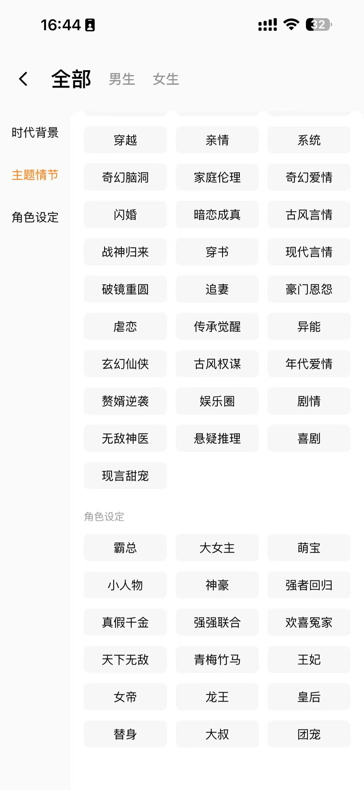
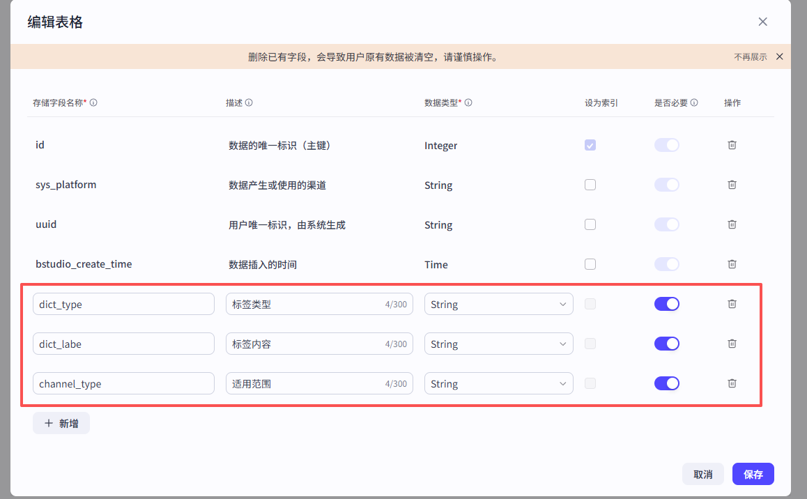
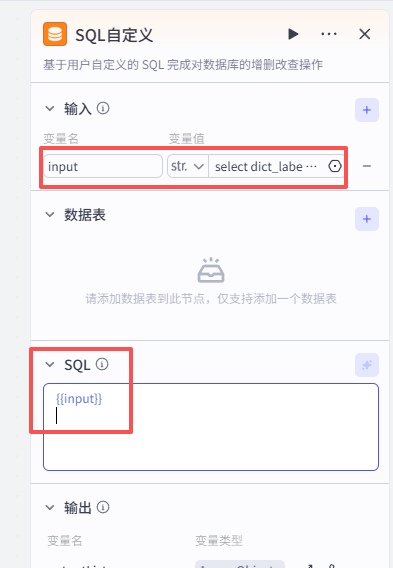
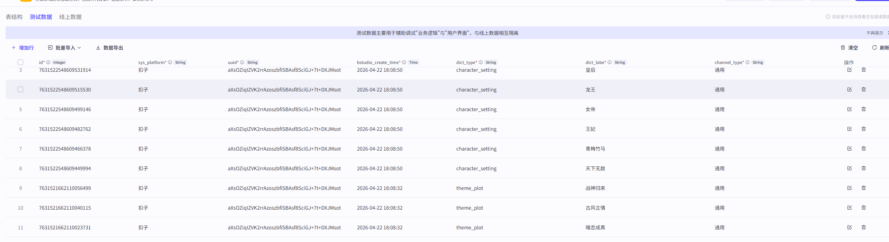
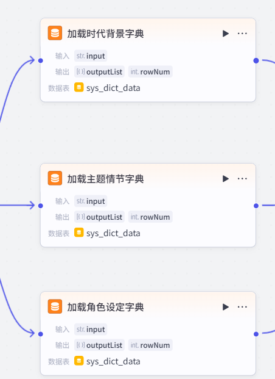
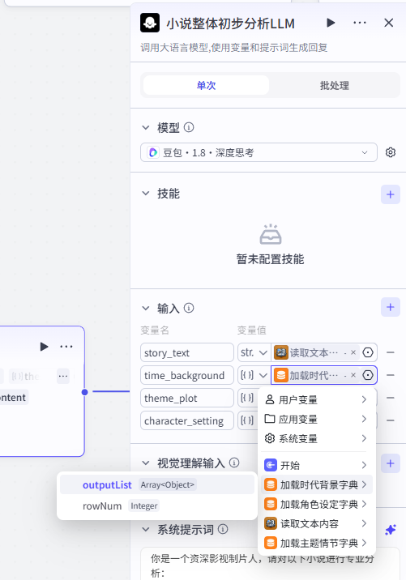
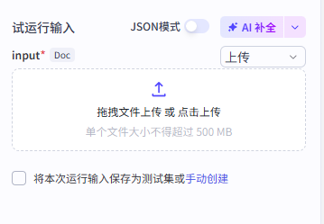
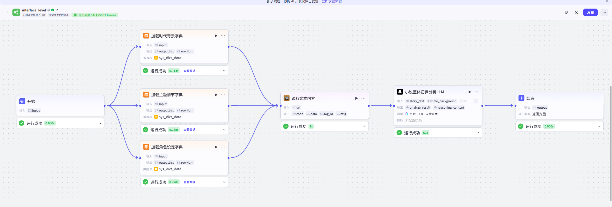

# interface_level（2）——建立字典表

在制作过程中，总会遇到一些需要用到的内容，需要反复从中挑选，但是对于不同的小说来说，这种内容或者说过程又是通用的。对于这种变量，我们就可以尝试建立字典表解决。而不需要在提示词中一个一个列举。

## 本项目常见的字典表

我们可以参考红果短剧的分布，提取相应的标签。示例如下



## 第一步，创建字典表

首先，新建一个自定义数据库节点：


在数据表一栏，新建一个数据表。


选择自定义数据库，并选择扣子数据库吗，填写数据库名称（英文），以及描述


然后新增定义行，本项目参考如下：



## 第二步，初始化数据

我们可以直接在界面上新增一行数据。但是如果数据太多，我们也可以借用扣子的调试功能完成数据的初始化。

对于没有学习过SQL的朋友，此部分完全可以让AI代劳。参考的步骤如下：

1. 上传截图给AI(本项目使用豆包)。让AI提取页面中的时代背景、主题情节、以及角色设定的所有标签。

2. 告诉AI你的目的。参考示例：我现在有一个数据库表，名字为sys_dict_data，这张表中有这几个字段：dict_typ、dict_labe、channel_type（默认值为通用），我现在要把你刚刚提取的标签，插入到这张表中，我的数据库是MySQL。请提供插入的SQL语句。

3. 将豆包的回复SQL内容（或者直接使用我这边生成的SQL语句），复制给输入的input节点中，并且在SQL一栏，输入```{{input}}```,表示这里引用input变量中的值。其中，输出的rowNum是指影响的行，插入成功多少行，就影响了多少行。

   

4. 接下来，点击右上角的执行。便可以实现批量的导入。示例效果如下：

   

   

## 第三步 给LLM节点复制

我们新增SQL 自定义节点，将内容分别提取出来：



以加载时代背景为例：

```sql
select dict_labe from  sys_dict_data  where dict_type = 'time_background'
```

随后把结果传给LLM



此时，提示词部分：

```tex
2. 判断小说的时代背景，必填，参考字典：
{{time_background}}
3. 判断小说的主题情节（可多选），参考字典，必填
{{theme_plot}}
4. 提取角色设定相关标签（3–6个），如果没有符合的，可以不填，非必填，参考字典
{{character_setting}}
```

也就有了值。

## 第四步 试运行

点击试运行，我们可以可以上传小说了：



运行示例：



## 参考SQL语句

```sql
select dict_labe from  sys_dict_data  where dict_type = 'time_background'
-- 1. 插入【时代背景】相关标签
INSERT INTO sys_dict_data (dict_type, dict_labe, channel_type) VALUES 
( 'time_background', '职场', '通用'),
( 'time_background', '民国', '通用'),
( 'time_background', '校园', '通用'),
( 'time_background', '历史古代', '通用'),
( 'time_background', '古装', '通用');

-- 2. 插入【主题情节】相关标签
INSERT INTO sys_dict_data (dict_type, dict_labe, channel_type) VALUES 
( 'theme_plot', '打脸虐渣', '通用'),
( 'theme_plot', '逆袭', '通用'),
( 'theme_plot', '马甲', '通用'),
( 'theme_plot', '女性成长', '通用'),
( 'theme_plot', '都市日常', '通用'),
( 'theme_plot', '重生', '通用'),
( 'theme_plot', '穿越', '通用'),
( 'theme_plot', '亲情', '通用'),
( 'theme_plot', '系统', '通用'),
( 'theme_plot', '奇幻脑洞', '通用'),
( 'theme_plot', '家庭伦理', '通用'),
( 'theme_plot', '奇幻爱情', '通用'),
( 'theme_plot', '闪婚', '通用'),
( 'theme_plot', '暗恋成真', '通用'),
( 'theme_plot', '古风言情', '通用'),
( 'theme_plot', '战神归来', '通用'),
( 'theme_plot', '穿书', '通用'),
( 'theme_plot', '现代言情', '通用'),
( 'theme_plot', '破镜重圆', '通用'),
( 'theme_plot', '追妻', '通用'),
( 'theme_plot', '豪门恩怨', '通用'),
( 'theme_plot', '虐恋', '通用'),
( 'theme_plot', '传承觉醒', '通用'),
( 'theme_plot', '异能', '通用'),
( 'theme_plot', '玄幻仙侠', '通用'),
( 'theme_plot', '古风权谋', '通用'),
( 'theme_plot', '年代爱情', '通用'),
( 'theme_plot', '赘婿逆袭', '通用'),
( 'theme_plot', '娱乐圈', '通用'),
( 'theme_plot', '剧情', '通用'),
( 'theme_plot', '无敌神医', '通用'),
( 'theme_plot', '悬疑推理', '通用'),
( 'theme_plot', '喜剧', '通用'),
( 'theme_plot', '现言甜宠', '通用');

-- 3. 插入【角色设定】相关标签
INSERT INTO sys_dict_data (dict_type, dict_labe, channel_type) VALUES 
( 'character_setting', '霸总', '通用'),
( 'character_setting', '大女主', '通用'),
( 'character_setting', '萌宝', '通用'),
( 'character_setting', '小人物', '通用'),
( 'character_setting', '神豪', '通用'),
( 'character_setting', '强者回归', '通用'),
( 'character_setting', '真假千金', '通用'),
( 'character_setting', '强强联合', '通用'),
( 'character_setting', '欢喜冤家', '通用'),
( 'character_setting', '天下无敌', '通用'),
( 'character_setting', '青梅竹马', '通用'),
( 'character_setting', '王妃', '通用'),
( 'character_setting', '女帝', '通用'),
( 'character_setting', '龙王', '通用'),
( 'character_setting', '皇后', '通用'),
( 'character_setting', '替身', '通用'),
( 'character_setting', '大叔', '通用'),
( 'character_setting', '团宠', '通用');	
```

