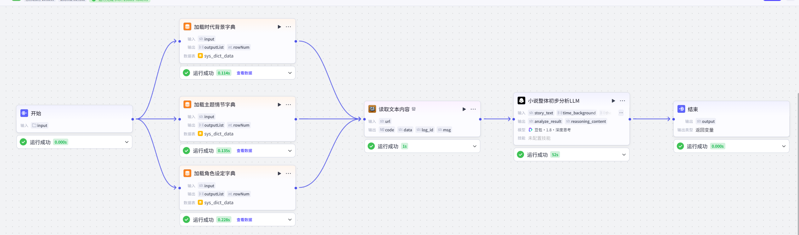
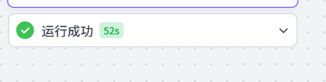
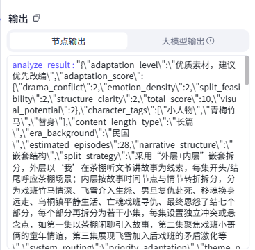

# JSON数据格式简介

紧接着上一次的试运行：



展开运行成功节点，可以看到以下内容：



这里有两个输出：



注意，这里**一定要切换到大模型输出**，因为这才是标准的JSON格式输出。复制下来,示例如下：

```json
{
  "narrative_structure": "嵌套结构",
  "era_background": "民国",
  "theme_plots": [
    "恐怖悬疑",
    "奇幻脑洞",
    "虐恋",
    "剧情"
  ],
  "character_tags": [
    "小人物",
    "青梅竹马",
    "替身"
  ],
  "adaptation_score": {
    "drama_conflict": 2,
    "visual_potential": 2,
    "structure_clarity": 2,
    "emotion_density": 2,
    "split_feasibility": 2,
    "total_score": 10
  },
  "adaptation_level": "优质素材，建议优先改编",
  "estimated_episodes": 22,
  "split_strategy": "采用“外层+内层”嵌套拆分，外层以‘我’在茶棚听文爷讲故事为线索，每集开头/结尾呼应茶棚场景；内层按故事时间节点与情节转折拆分，分为扬州戏班恩怨、乌桐镇平静生活、怨魂归来复仇、最终救赎结局四个部分，每个部分再拆分为若干小集，确保每集具备独立冲突或悬念点",
  "system_routing": "priority_adaptation",
  "content_length_type": "长篇"
}
```

输出结构化的目的是为了方便后续的结构化分析。下面简单介绍一下Json。已经有了解的，完全可以跳过下面的内容。

## JSON数据格式

简单来说，**JSON**（JavaScript Object Notation）是一种轻量级的**数据交换格式**。

虽然它的名字里带有 JavaScript，但它现在是一种**独立于语言**的文本格式。无论是 Python、Java、C++ 还是 Go，几乎所有主流编程语言都能轻松地读取和生成 JSON。

**JSON的本质，是一串遵循某种格式规则的字符串。**

### 1. JSON基础语法

JSON 的语法非常直观，主要由以下两种结构组成：

1. **对象（Object）：** 用花括号 `{}` 包围，里面是“键: 值”对（key: value）。
2. **数组（Array）：** 用方括号 `[]` 包围，里面是值的列表。

**基本语法要求：**

- **键（Key）** 必须是双引号包裹的字符串。
- **值（Value）** 可以是：字符串、数字、布尔值（true/false）、null、对象或数组。
- 数据之间用**逗号**分隔。

```json
{
  "name": "张三",
  "age": 25,
  "isStudent": false,
  "hobbies": ["摄影", "编程", "徒步"],
  "address": {
    "city": "上海",
    "zipCode": "200000"
  }
}
```

### 2. 常见应用场景

- **前后端交互：** 当你打开网页或 App 时，服务器通常会把数据以 JSON 格式传给前端展示。
- **配置文件：** 很多软件（如 VS Code）使用 `.json` 文件来保存用户的个性化设置。
- **接口文档：** RESTful API 基本都默认使用 JSON 作为数据传输的标准。

 本项目中，不同的业务节点，都使用JSON格式进行数据传输。至于取值，后续的python中会有体现，如果不会写，可以找AI代劳。
