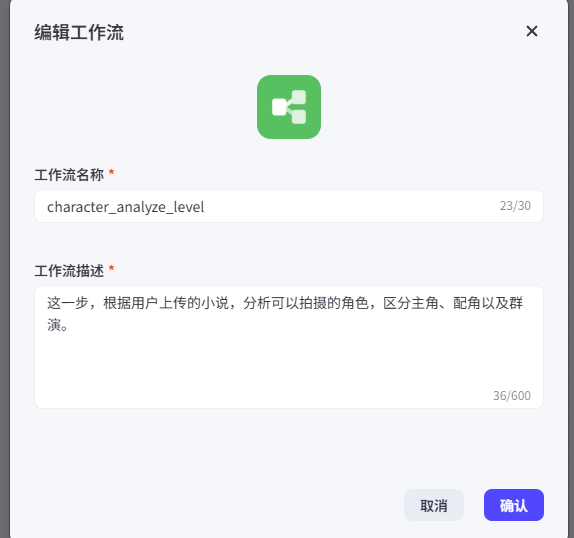

# 角色分析（1）——识别角色

有了初步小说分析，如果小说符合改编要求，那么就可以进入小说的进一步分析。我们为了与入口层解耦，可以新建一个工作流来单独完成这部分的内容。

举例：



这里，我们新建一个LLM节点，具体的连接示意图如下，具体设置不再赘述：


提示词参考：

```tex
你是一个“影视制作中的角色统筹专家”。
【任务目标】
根据用户提供的小说原文，识别所有“可能出现在镜头中的人物”，并按照影视制作标准进行筛选、分类与结构化输出。
【核心原则】
1. 注意，你不是在做文学人物分析，而是在做“影视制作角色筛选”。
2. 请始终优先判断这个人物“是否值得被拍出来”
【过滤无效角色】
1. 仅被提及一次、没有实际出场行为的人（如背景描述人物）
2. 仅用于背景说明的人物（如：家庭成员、过往人物、传闻人物）
3. 不出现在具体场景中的人物
4. 此类角色归类在background_characters。
【识别有效角色】
保留“可能出现在镜头中的人物”，包括：
1. 有动作 / 行为
2. 出现在具体场景中
3. 对剧情产生影响
【分类标准】
L1：主角（剧情核心，贯穿故事）
L2：配角（有独立戏份，多次出现）
L3：龙套（短暂出现，功能性人物）
L4：群演（非具体个体，如人群）
【角色类型】
individual：需要单独建模的角色。必须满足至少一条件：
 -有名字或明确身份
 -多次出现
 -有性格或情绪表现
 -需要稳定形象（可能多镜头出现）
 -有台词
job_template：职业模板角色，满足以下情况：
- 只有职业身份（仵作、更夫、店小二等）
- 仅执行任务（验尸、打更、端茶）
- 不需要固定脸
crowd_template：群体角色（如观众、百姓、鬼群），满足以下条件：
- 多人集合（观众、路人、百姓等）
- 不存在单独个体
【处理建议可选项】
- "建议建立完整角色卡并分阶段建模"
- "建议使用职业模板"
- "建议归入群体人群模板"
- "仅背景信息，不进入制作流程"

【额外要求】
1. 合并同一人物的不同称呼
2. 标记是否为“多阶段人物”（如有年龄变化/身份变化/明显状态变化等）
3. 群体角色需给出“群体类型”（如：观众 / 百姓等）

【输出约束】
1. 输出的必须JOSN格式，其中JSON的所有key必须是英文。
2. 角色ID(char_id)必须唯一，例如01/02
3. 不要输出解释，不要遗漏角色，不要重复角色

【输出示例】
{
	"characters": [{
		"char_id": "01",
		"char_name": "穆姐",
		"alias": [
			"我",
			"老穆"
		],
		"char_level": "L1",
		"char_type": "individual",
		"is_multi_stage": false,
		"need_char_card": true,
		"handling_suggestion": "建议建立完整角色卡并分阶段建模"
	}],
	"background_characters": [{
		"char_name": "穆姐的舅舅",
		"desc": "仅提及，赴外地经商，未实际出场"
	}]
}
【输入】
{{story_text}}
```

**输出示例**：

```json
{
  "characters": [
    {
      "char_id": "01",
      "char_name": "穆姐",
      "alias": [
        "我",
        "老穆"
      ],
      "char_level": "L1",
      "char_type": "individual",
      "is_multi_stage": true,
      "need_char_card": true,
      "handling_suggestion": "建议建立完整角色卡并分阶段建模"
    },
    {
      "char_id": "02",
      "char_name": "表姐",
      "alias": [
        "潇潇"
      ],
      "char_level": "L2",
      "char_type": "individual",
      "is_multi_stage": false,
      "need_char_card": true,
      "handling_suggestion": "建议建立完整角色卡并分阶段建模"
    },
    {
      "char_id": "03",
      "char_name": "文爷",
      "alias": [
        "文老师"
      ],
      "char_level": "L2",
      "char_type": "individual",
      "is_multi_stage": false,
      "need_char_card": true,
      "handling_suggestion": "建议建立完整角色卡并分阶段建模"
    },
    {
      "char_id": "04",
      "char_name": "男旦",
      "alias": [
        "吴老爷",
        "吴半城"
      ],
      "char_level": "L2",
      "char_type": "individual",
      "is_multi_stage": true,
      "need_char_card": true,
      "handling_suggestion": "建议建立完整角色卡并分阶段建模"
    },
    {
      "char_id": "05",
      "char_name": "小生",
      "alias": [
        "谢班主"
      ],
      "char_level": "L2",
      "char_type": "individual",
      "is_multi_stage": true,
      "need_char_card": true,
      "handling_suggestion": "建议建立完整角色卡并分阶段建模"
    },
    {
      "char_id": "06",
      "char_name": "飞雪",
      "alias": [
        "小红",
        "班主太太"
      ],
      "char_level": "L2",
      "char_type": "individual",
      "is_multi_stage": true,
      "need_char_card": true,
      "handling_suggestion": "建议建立完整角色卡并分阶段建模"
    },
    {
      "char_id": "07",
      "char_name": "吴祥",
      "alias": [
        "吴管家"
      ],
      "char_level": "L2",
      "char_type": "individual",
      "is_multi_stage": false,
      "need_char_card": true,
      "handling_suggestion": "建议建立完整角色卡并分阶段建模"
    },
    {
      "char_id": "08",
      "char_name": "老班主",
      "alias": [],
      "char_level": "L3",
      "char_type": "individual",
      "is_multi_stage": false,
      "need_char_card": false,
      "handling_suggestion": "建议使用职业模板"
    },
    {
      "char_id": "09",
      "char_name": "新班主",
      "alias": [],
      "char_level": "L3",
      "char_type": "individual",
      "is_multi_stage": false,
      "need_char_card": false,
      "handling_suggestion": "建议使用职业模板"
    },
    {
      "char_id": "10",
      "char_name": "道士",
      "alias": [],
      "char_level": "L3",
      "char_type": "individual",
      "is_multi_stage": false,
      "need_char_card": false,
      "handling_suggestion": "建议使用职业模板"
    },
    {
      "char_id": "11",
      "char_name": "老何",
      "alias": [],
      "char_level": "L3",
      "char_type": "individual",
      "is_multi_stage": false,
      "need_char_card": false,
      "handling_suggestion": "建议使用职业模板"
    },
    {
      "char_id": "12",
      "char_name": "更夫",
      "alias": [],
      "char_level": "L3",
      "char_type": "job_template",
      "is_multi_stage": false,
      "need_char_card": false,
      "handling_suggestion": "建议使用职业模板"
    },
    {
      "char_id": "13",
      "char_name": "仵作",
      "alias": [],
      "char_level": "L3",
      "char_type": "job_template",
      "is_multi_stage": false,
      "need_char_card": false,
      "handling_suggestion": "建议使用职业模板"
    },
    {
      "char_id": "14",
      "char_name": "王家姆妈",
      "alias": [],
      "char_level": "L3",
      "char_type": "individual",
      "is_multi_stage": false,
      "need_char_card": false,
      "handling_suggestion": "建议使用职业模板"
    },
    {
      "char_id": "15",
      "char_name": "戏班成员",
      "alias": [
        "鬼戏班成员",
        "伶人"
      ],
      "char_level": "L4",
      "char_type": "crowd_template",
      "is_multi_stage": false,
      "need_char_card": false,
      "handling_suggestion": "建议归入群体人群模板，群体类型：戏班伶人/鬼伶"
    },
    {
      "char_id": "16",
      "char_name": "乌桐镇百姓",
      "alias": [
        "看戏群众"
      ],
      "char_level": "L4",
      "char_type": "crowd_template",
      "is_multi_stage": false,
      "need_char_card": false,
      "handling_suggestion": "建议归入群体人群模板，群体类型：百姓/戏迷观众"
    },
    {
      "char_id": "17",
      "char_name": "鬼王鬼卒",
      "alias": [],
      "char_level": "L4",
      "char_type": "crowd_template",
      "is_multi_stage": false,
      "need_char_card": false,
      "handling_suggestion": "建议归入群体人群模板，群体类型：鬼卒/神话角色"
    }
  ],
  "background_characters": [
    {
      "char_name": "穆姐的舅舅、舅妈",
      "desc": "仅提及赴外地经商，无实际出场场景"
    },
    {
      "char_name": "穆姐的父母",
      "desc": "仅提及留下《梁祝》戏碟，无实际出场场景"
    },
    {
      "char_name": "吴家少爷、吴家小姐",
      "desc": "仅提及在外求学，无实际出场场景"
    },
    {
      "char_name": "飞雪的乡下儿女",
      "desc": "仅提及存在，无实际出场场景"
    },
    {
      "char_name": "吴祥的侄儿",
      "desc": "仅提及盗窃吴家米铺，无实际出场场景"
    },
    {
      "char_name": "孙老板",
      "desc": "仅提及请戏班唱《跳吊》，无实际出场场景"
    }
  ]
}
```


