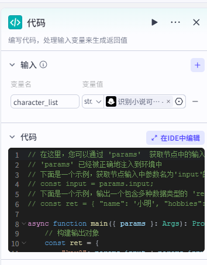
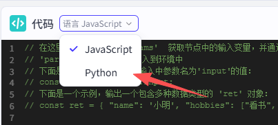
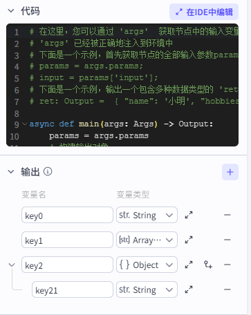
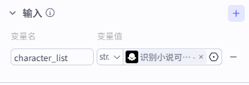
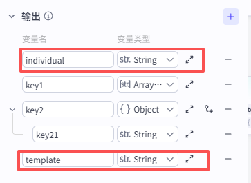
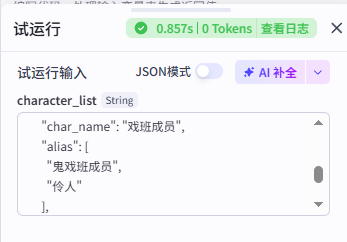
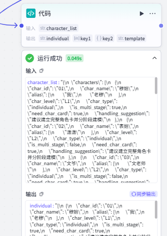

# 2.补充知识——代码节点（可选）

对于一些人物角色相对复杂的小说（比如长篇小说或者嵌套小说），可以考虑将主要角色进行进一步的细化，包括角色的人物设定、性格设定、语言风格等等。以及在剧情中的作用、人物关系网等等。为后期的配音、人物行为做准备。

不过，在这之前，需要把上一步分析出来的主要角色跟次要角色分离出来。这里我们要做的，是把Json中的含有individual值的所有Json对象都提取出来，给到大模型进行分析，因此，我们可以使用Python代码节点，对这部分内容进行处理：



这里我们将上一个节点的输入，作为入参，在IDE中编辑代码，先把代码模式切换到python：



```python
# 在这里，您可以通过 'args'  获取节点中的输入变量，并通过 'ret' 输出结果
# 'args' 已经被正确地注入到环境中
# 下面是一个示例，首先获取节点的全部输入参数params，其次获取其中参数名为'input'的值：
# params = args.params; 
# input = params['input'];
# 下面是一个示例，输出一个包含多种数据类型的 'ret' 对象：
# ret: Output =  { "name": '小明', "hobbies": ["看书", "旅游"] };

async def main(args: Args) -> Output:
    params = args.params
    # 构建输出对象
    ret: Output = {
        "key0": params['input'] + params['input'], # 拼接两次入参 input 的值
        "key1": ["hello", "world"],  # 输出一个数组
        "key2": { # 输出一个Object 
            "key21": "hi"
        },
    }
    return ret
```

对比输出的格式：



很容易得出，我们把处理好的业务值，返回给对应的变量名，对应变量类型就可以了。官方给的输出示例，我没研究，毕竟不是专业的python程序员，代码能用就行。

```params = args.params```

是获取输入的参数列表，然后后续跟参数名称即可：



比如：```params['character_list']```,是指获取character_list的值。完整代码如下：

```python
# 在这里，您可以通过 'args'  获取节点中的输入变量，并通过 'ret' 输出结果
# 'args' 已经被正确地注入到环境中
# 下面是一个示例，首先获取节点的全部输入参数params，其次获取其中参数名为'input'的值：
# params = args.params; 
# input = params['input'];
# 下面是一个示例，输出一个包含多种数据类型的 'ret' 对象：
# ret: Output =  { "name": '小明', "hobbies": ["看书", "旅游"] };
import json
async def main(args: Args) -> Output:
    params = args.params
    input = params['character_list']
    # 构建输出对象
    ret: Output = {
        "individual":extract_individual_characters(input) , # 拼接两次入参 input 的值
        "key1": ["hello", "world"],  # 输出一个数组
        "key2": { # 输出一个Object 
            "key21": "hi"
        },
        "template":extract_template_characters(input)
    }
    return ret
def extract_individual_characters(json_str):
    # 将 JSON 字符串解析为 Python 字典
    data = json.loads(json_str)   
    # 提取 characters 列表
    all_chars = data.get("characters", []) 
    # 使用列表推导式筛选 level 为 L1 或 L2 的项
    filtered_chars = [
        char for char in all_chars 
        if char.get("char_type") in ["individual"] 
    ]
    # 将结果转换回 JSON 格式字符串（indent=2 用于美化输出）
    return json.dumps(filtered_chars, ensure_ascii=False, indent=2)
def extract_template_characters(json_str):
    # 将 JSON 字符串解析为 Python 字典
    data = json.loads(json_str) 
    # 提取 characters 列表
    all_chars = data.get("characters", [])    
    # 使用列表推导式筛选 
    filtered_chars = [
        char for char in all_chars 
        if char.get("char_type") in ["job_template","crowd_template"] 
    ]  
    # 将结果转换回 JSON 格式字符串（indent=2 用于美化输出）
    return json.dumps(filtered_chars, ensure_ascii=False, indent=2)
```

简单来说，extract_individual_characters将值为individual的对象提取出来，extract_template_characters将值为job_template、crowd_template的对象提取出来。代码的书写可以让AI代劳。参考询问方式：

```tex
我现在有一个json文件，请用python代码，将char_type中所有包含individual的json对象提取出来，并封装成函数extract_individual_characters，将char_type中所有包含job_template、crowd_template的json对象提取出来，并封装为extract_template_characters
```

接下来定义输出的字段，其他的不动




然后将JSON字符输入后，试运行：



输出成功后即可直接引用变量了：




