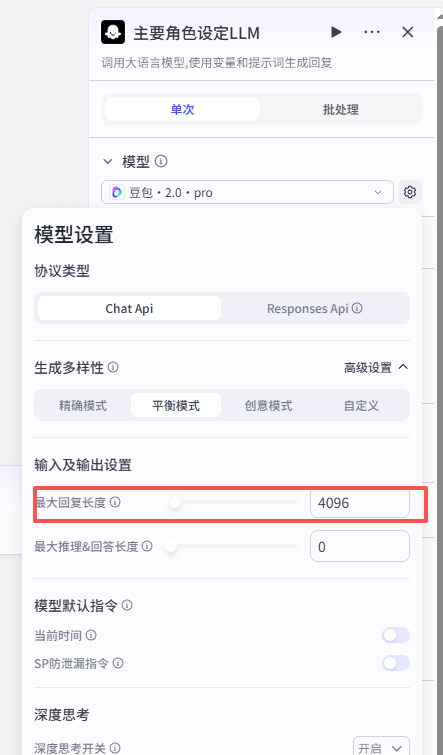
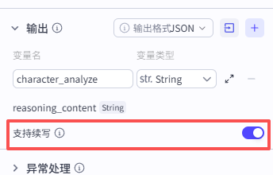
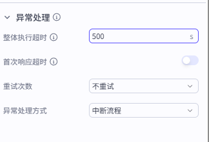
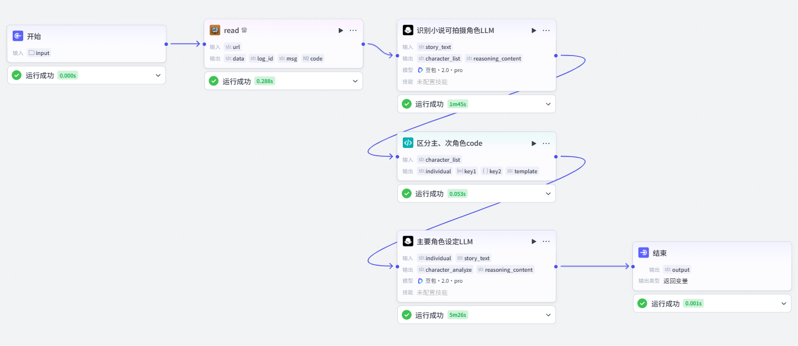

# 3. 角色分析（2）——主要角色设定（可选）

到了这一步，我们可以考虑分析主要角色设定了。这部分的提示词很长，很多都是基本信息，主要分析一下这两个参数：

- 识别人物阶段(phases)：一般的长篇小说，如果存在时间跨度，那么人物就会存在不同的人生阶段，比如小时候、青年时期、中年时期、老年时期。
- 识别表现状态（performance_state）：如果小说中，在某个阶段中，存在人物的不同表现形态时（比如上台表演、恶魔附身等等，对该时段的角色具有一定的外表或者气质改变的，需要识别出来。

因此，唯一确定人物形象的有公式为：

```tex
人物ID（char_id) + 阶段ID（phases_id) + 表现形态(performance_state)
```

例如：

张三在年轻时期的唱戏形态。张三在年轻时期的日常形态。可能在AI绘图中，提示词是不一样的。

其他的一些参数介绍：

- 年龄：这里注意要告诉AI给一个具体的数值，比如文章可能提到一个中年妇女，并没有给具体的年龄，它可能就直接给你一个跨度很大的范围。与其如此，不如让AI自动合理推测。有些AI模型会给定年龄后，不校验逻辑的合理性。比如姐姐25岁，妹妹31岁。如果出现此类情况，可以在提示词中。要求AI在设置年龄时，考虑关系的逻辑性。
- 性格模型：这部分主要是后面编写剧本的时候，让角色的一些动作行为更贴合原著。
- 语言模型、情绪基调：可以作为后续配音时的一个音色参考。
- 关系网络等其他属于可选字段，参考即可。

提示词参考如下：

```tex
你是一名专业影视编剧与角色设计师，擅长将小说人物结构化为可用于剧本与影视制作的“人物设定系统”。
【输入】
小说原文：{{story_text}}
核心人物列表：{{individual}}
【任务目标】
请严格基于输入小说原文和核心人物列表，构建“可用于后续剧本生成的核心角色模型”。
【输出要求】
请为每个关键人物建立完整结构，包含以下模块：
一、基础信息,如果输入的信息中存在相同的信息，不要修改输入的数据
- 人物ID：直接使用上层输入，不要更改。
- 人物名
- 别名
- 性别
- 年龄（必须为具体数值，不允许范围）
- 身份 / 职业
- 外在特征（外貌 / 气质）
注意，年龄必须符合逻辑，可以根据人物关系网判断，比如姐姐的年龄应该大于妹妹。
二、性格模型（用关键词 + 行为描述）
必须包含：
- 性格特点：
- 性格关键词（3~5个）
- 行为倾向（遇事如何反应）
- 冲突反应方式（是隐忍 / 爆发 / 逃避）
三、语言模型（表达层），决定对白风格（非常关键）
必须包含：
- 说话风格（简短 / 冷静 / 情绪化 / 讽刺等）
- 用词特点（文雅 / 口语 / 粗俗）
- 是否爱反问 / 是否直接表达
四、核心动机（驱动层）：这是人物行为的“发动机”
- 当前目标
- 深层欲望（隐藏动机）
- 最大执念
五、情绪基调（稳定层）
- 整体情绪倾向（压抑 / 冷静 / 暴躁）
- 情绪变化触发点（什么会让他失控）
六、关系网络（结构层）
必须具体写清楚人与人关系：
{
  "与某人关系": "仇人 / 爱人 / 上下级",
  "关系状态": "紧张 / 依赖 / 对立"
}
七、人物弧光（可选但强烈建议），用于分集节奏控制
- 初始状态
- 变化方向
- 可能的转折点
八、识别人物阶段(phases)，每个阶段赋予一个阶段ID(参考：01_P01)。
如果人物变化满足：长期持续 / 不可切换，影响核心身份或人格时。包括：
- 身份变化
- 年龄变化
- 灵魂变化（人 → 鬼 / 被夺舍长期存在）
必须拆分为“多个阶段”输出。包含每个阶段的：
年龄
阶段名：xxx时期
时代背景：民国/古代/现代都市/乡村/校园等（可以多选，但是不能冲突）
外观
性格
状态
九、此为非必须节点，如果在第八点人物阶段的基础上，如果人物变化满足：场景触发、可切换 / 可恢复（即即表示人物在不同场景下的外观与状态（可切换））。则识别表现形态(performanceState)，每个状态赋予一个状态ID（格式参考：01_P01_S01)包括：
上台表演 / 扮演角色
易容 / 伪装
工作状态（上班 / 执行任务）
战斗状态
短期附身 / 异常状态
【输出约束】
1. 所有人物设定必须来源于原文，不允许虚构不存在的人物
2. 人物必须具备“行为一致性”，语言风格必须稳定（用于后续对白生成）
3. 输出的必须JOSN格式，其中JSON的所有key必须是英文。
4. 输出示例：
{
	"char_id": "01",
	"char_Name": "男旦",
	"alias": ["吴老爷", "谢班主"],
	"sex": "男",
	"phases": [{
		"phase_ID": "01_P01",
		"phase_Name": "男旦时期",
		"age": 25,
		"timeBackground":"民国"
		"phaseIdentity": "戏班演员",
		"phaseAppearance": "清秀白净",
		"phasePersonality": "隐忍深情",
		"languageModel": {
			"speechStyle": "轻柔话少，唱戏时婉转多情，平时很少主动说话",
			"wording": "文雅，符合戏子身份，几乎不说粗话",
			"rhetoricalQuestionPreference": "很少使用反问，习惯隐忍情绪不表达",
			"expressDirectness": "非常委婉，大部分情绪都压在心里不说"
		},
		"coreMotivation": {
			"currentGoal": "打发工作淡季的空闲时间，听各种鬼故事找刺激",
			"hiddenDesire": "帮表妹走出创作瓶颈，让表妹尽快恢复状态",
			"obsession": "对灵异鬼故事的强烈兴趣"
		},
		"emotionalTone": {
			"overallTendency": "平和，略带迷茫",
			"triggerPoint": "听到触及人性阴暗或极致深情的故事会情绪失控，忍不住共情落泪"
		},
		"relationshipNetwork": [{
			"relatedPerson": "潇潇",
			"relationship": "表姐妹",
			"status": "亲密依赖"
		}, {
			"relatedPerson": "文爷",
			"relationship": "茶棚经营者与茶客/故事听众与讲述者",
			"status": "友好融洽，有共同语言"
		}],
		"performanceState": [{
			"State_id": "01_P01_S01",
			"State_name": "上台表演",
			"appearanceChange": "穿花旦戏服，戴头面，妆容艳丽，身段柔媚",
			"state_describe": "完全入戏，情绪饱满，和平时怯懦的样子判若两人"
		}]
	}],
	"characterArc": {
		"initialState": "灵感枯竭的失意作家，逃避城市生活和创作压力，对现状不满又无力改变",
		"changeDirection": "在收集故事的过程中重新感知人性的复杂，找回创作热情和生活动力",
		"turningPoint": "采纳表姐用茶换故事的建议，听到文爷讲述的女吊故事，被其中的恩怨情仇打动，开始重新思考创作的意义"
	}
}
```

在试运行之前，由于上传的文件较大，且分析难度较高，我们需要对模型进行特殊设置：

1. 在模型设置中，将模型输出的最大值拉满：

   

2. 在输出中，命名为character_analyze，勾选续写：

   

3. 最后在异常处理中（**最重要**），将超时时间改为500：

   

4. 最终运行即可：



这里，如果为了省token，也可以直接手动把上一次的结果暂时存起来，然后利用LLM的单节点运行机制。直接运行即可。可以省去每次整个流程重跑一次。

输出示例如下：

```json
[
  {
    "char_id": "01",
    "char_Name": "穆姐",
    "alias": [
      "我",
      "老穆"
    ],
    "sex": "女",
    "phases": [
      {
        "phase_ID": "01_P01",
        "phase_Name": "城市创作瓶颈期",
        "age": 31,
        "timeBackground": "现代都市",
        "phaseIdentity": "职业作家",
        "phaseAppearance": "轻熟女气质，长期伏案导致颈椎不好、近视，常戴框架眼镜，脸色偏憔悴，有失眠痕迹",
        "phasePersonality": "敏感文艺，焦虑逃避，有精神洁癖",
        "languageModel": {
          "speechStyle": "话不多，带自嘲感，偶尔emo",
          "wording": "偏文艺，夹杂网络流行语，不说粗话",
          "rhetoricalQuestionPreference": "较少反问，习惯自我消化情绪",
          "expressDirectness": "偏委婉，对创作相关的问题很较真"
        },
        "coreMotivation": {
          "currentGoal": "写出不重复自己的新作品",
          "hiddenDesire": "证明自己的创作能力，摆脱自我怀疑",
          "obsession": "拒绝写套路化、重复自我的内容"
        },
        "emotionalTone": {
          "overallTendency": "压抑焦虑，迷茫丧",
          "triggerPoint": "写不出满意内容时会烦躁失眠，自我否定"
        },
        "relationshipNetwork": [
          {
            "relatedPerson": "表姐",
            "relationship": "表姐妹",
            "status": "依赖，信任"
          },
          {
            "relatedPerson": "舅舅舅妈",
            "relationship": "外甥女与长辈",
            "status": "亲近，受照顾"
          }
        ],
        "performanceState": [
          {
            "State_id": "01_P01_S01",
            "State_name": "写作状态",
            "appearanceChange": "窝在书桌前，皱着眉，反复删改稿子，时不时揉颈椎",
            "state_describe": "非常专注，容易烦躁，对外界声音反应迟钝"
          }
        ]
      },
      {
        "phase_ID": "01_P02",
        "phase_Name": "小镇茶棚经营期",
        "age": 32,
        "timeBackground": "现代南方小镇",
        "phaseIdentity": "茶棚临时经营者、故事收集者",
        "phaseAppearance": "穿着休闲舒适，气质松弛，气色变好，常带着笑意",
        "phasePersonality": "随性随和，共情力强，好奇心重",
        "languageModel": {
          "speechStyle": "轻松接地气，爱接话，偶尔吐槽",
          "wording": "口语化，夹杂小镇方言词汇，很有亲和力",
          "rhetoricalQuestionPreference": "偶尔用反问打趣，很少抬杠",
          "expressDirectness": "直接自然，不绕弯子"
        },
        "coreMotivation": {
          "currentGoal": "休养身体，收集民间故事素材",
          "hiddenDesire": "找回创作初心，完成《老穆茶棚》故事集",
          "obsession": "记录真实、有温度的民间故事，拒绝俗套内容"
        },
        "emotionalTone": {
          "overallTendency": "平和慵懒，略带好奇",
          "triggerPoint": "听到触及人性复杂、极致情感的故事会共情到胸口发闷、手指发凉"
        },
        "relationshipNetwork": [
          {
            "relatedPerson": "表姐",
            "relationship": "表姐妹",
            "status": "亲密无间，互相陪伴"
          },
          {
            "relatedPerson": "文爷",
            "relationship": "茶棚老板与熟客/故事收集者与讲述者",
            "status": "友好融洽，有共同语言"
          },
          {
            "relatedPerson": "镇上茶客",
            "relationship": "经营者与消费者",
            "status": "熟络随和"
          }
        ],
        "performanceState": [
          {
            "State_id": "01_P02_S01",
            "State_name": "听故事状态",
            "appearanceChange": "托着腮，眼神专注，时不时记笔记",
            "state_describe": "完全投入故事中，情绪随情节波动"
          },
          {
            "State_id": "01_P02_S02",
            "State_name": "经营茶棚状态",
            "appearanceChange": "穿着围裙，手脚麻利地烧水倒茶",
            "state_describe": "随和热情，和茶客天南海北闲扯"
          }
        ]
      }
    ],
    "characterArc": {
      "initialState": "灵感枯竭的失意作家，逃避城市压力和创作瓶颈，陷入自我怀疑",
      "changeDirection": "在收集民间故事的过程中感知人性复杂，找回创作热情和生活动力，完成个人成长",
      "turningPoint": "采纳表姐用茶换故事的建议，听到文爷讲述的女吊故事，被其中跨越生死的恩怨情仇震撼，决定开始创作《老穆茶棚》故事集"
    }
  },
  {
    "char_id": "02",
    "char_Name": "表姐",
    "alias": [
      "潇潇"
    ],
    "sex": "女",
    "phases": [
      {
        "phase_ID": "02_P01",
        "phase_Name": "小镇生活期",
        "age": 34,
        "timeBackground": "现代南方小镇",
        "phaseIdentity": "艺校老师",
        "phaseAppearance": "长相开朗明艳，性格咋呼，穿着休闲时尚",
        "phasePersonality": "热情仗义，神经大条，爱凑热闹，胆子大（自称），其实有点怂",
        "languageModel": {
          "speechStyle": "语速快，情绪化，爱咋呼，喜欢撒娇吐槽",
          "wording": "非常口语化，接地气，偶尔蹦出网络热梗",
          "rhetoricalQuestionPreference": "爱用反问，咋咋呼呼的",
          "expressDirectness": "非常直接，想到什么说什么，不藏情绪"
        },
        "coreMotivation": {
          "currentGoal": "打发工作淡季的空闲时间，听鬼故事找刺激",
          "hiddenDesire": "帮表妹走出创作瓶颈，让表妹开心起来",
          "obsession": "对灵异鬼故事有强烈兴趣，越怕越想听"
        },
        "emotionalTone": {
          "overallTendency": "活泼开朗，咋咋呼呼",
          "triggerPoint": "听到吓人的鬼故事会吓得捂耳朵尖叫，听到渣男负心的情节会气得破口大骂"
        },
        "relationshipNetwork": [
          {
            "relatedPerson": "穆姐",
            "relationship": "表姐妹",
            "status": "亲密，照顾表妹"
          },
          {
            "relatedPerson": "文爷",
            "relationship": "故事听众与讲述者",
            "status": "熟络，爱插嘴提问"
          },
          {
            "relatedPerson": "舅舅舅妈",
            "relationship": "女儿与父母",
            "status": "亲近，替父母看家"
          }
        ],
        "performanceState": [
          {
            "State_id": "02_P01_S01",
            "State_name": "听鬼故事状态",
            "appearanceChange": "一会儿捂耳朵缩脖子，一会儿气得拍桌子，情绪波动极大",
            "state_describe": "完全投入，代入感极强"
          }
        ]
      }
    ],
    "characterArc": {
      "initialState": "闲得慌的艺校老师，只爱听刺激的鬼故事，对人性的认知非黑即白",
      "changeDirection": "在听故事的过程中逐渐理解人性的复杂，不再用简单的善恶评判人",
      "turningPoint": "听完文爷讲的完整女吊故事，明白乱世中每个人都有身不由己的苦衷，不再单纯骂小生是渣男"
    }
  },
  {
    "char_id": "03",
    "char_Name": "文爷",
    "alias": [
      "文老师"
    ],
    "sex": "男",
    "phases": [
      {
        "phase_ID": "03_P01",
        "phase_Name": "退休养老期",
        "age": 62,
        "timeBackground": "现代南方小镇",
        "phaseIdentity": "退休中学老师",
        "phaseAppearance": "瘦高个，精神矍铄，爱抽烟，气质儒雅又接地气",
        "phasePersonality": "通透博闻，健谈风趣，爱聊天吹牛，喜欢和年轻人打交道",
        "languageModel": {
          "speechStyle": "语速慢，不紧不慢，爱卖关子，讲故事活色生香",
          "wording": "文雅夹杂小镇方言，用词生动，有文化底蕴",
          "rhetoricalQuestionPreference": "偶尔反问吊听众胃口",
          "expressDirectness": "娓娓道来，节奏把控得很好，不疾不徐"
        },
        "coreMotivation": {
          "currentGoal": "打发退休时间，和年轻人聊天讲故事",
          "hiddenDesire": "把自己知道的老故事、老理儿传下去",
          "obsession": "讲故事要讲得好听、引人入胜，喜欢看听众听得入迷的样子"
        },
        "emotionalTone": {
          "overallTendency": "平和通透，乐呵呵的",
          "triggerPoint": "没人认真听他讲故事会有点失落，听众反应热烈会讲得更起劲"
        },
        "relationshipNetwork": [
          {
            "relatedPerson": "穆姐、表姐",
            "relationship": "熟客与茶棚老板/故事讲述者与听众",
            "status": "友好融洽，有共同语言"
          },
          {
            "relatedPerson": "镇上居民",
            "relationship": "街坊",
            "status": "受人敬重，大家都爱听他讲故事"
          }
        ],
        "performanceState": [
          {
            "State_id": "03_P01_S01",
            "State_name": "讲故事状态",
            "appearanceChange": "抽着烟，眼神随故事内容变化，时不时呷一口茶",
            "state_describe": "非常投入，绘声绘色，情绪完全融入故事中"
          }
        ]
      }
    ],
    "characterArc": {
      "initialState": "退休后闲得慌的老教师，爱吹牛聊天，知道很多老故事",
      "changeDirection": "在讲故事的过程中把自己对人生、对善恶的感悟传递给年轻人",
      "turningPoint": "穆姐和表姐请他第一个讲换茶的故事，他把压箱底的女吊故事完整讲了出来"
    }
  },
  {
    "char_id": "04",
    "char_Name": "男旦",
    "alias": [
      "吴老爷",
      "吴半城"
    ],
    "sex": "男",
    "phases": [
      {
        "phase_ID": "04_P01",
        "phase_Name": "戏班男旦时期",
        "age": 25,
        "timeBackground": "民国江南/扬州",
        "phaseIdentity": "戏班头牌花旦",
        "phaseAppearance": "白净清秀，长相柔美，扮上花旦天衣无缝，手指纤细，留着长指甲",
        "phasePersonality": "隐忍深情，偏执极端，内向敏感，愿意为爱人付出一切",
        "languageModel": {
          "speechStyle": "轻柔话少，唱戏时婉转多情，平时很少主动说话",
          "wording": "文雅，符合戏子身份，几乎不说粗话",
          "rhetoricalQuestionPreference": "很少使用反问，习惯隐忍情绪不表达",
          "expressDirectness": "非常委婉，大部分情绪都压在心里不说"
        },
        "coreMotivation": {
          "currentGoal": "和师兄小生一直搭档唱戏，永远在一起",
          "hiddenDesire": "和小生的感情能得到回应，哪怕不被世俗接受",
          "obsession": "不许任何人抢走小生，愿意为他付出生命"
        },
        "emotionalTone": {
          "overallTendency": "压抑敏感，情绪都藏在心里",
          "triggerPoint": "看到小生和飞雪亲近，听到小生说“两个男子怎拜堂”时会崩溃"
        },
        "relationshipNetwork": [
          {
            "relatedPerson": "小生",
            "relationship": "师兄弟/暗恋对象",
            "status": "亲密依赖，爱而不得"
          },
          {
            "relatedPerson": "飞雪",
            "relationship": "情敌",
            "status": "对立怨恨"
          },
          {
            "relatedPerson": "老班主",
            "relationship": "演员与班主",
            "status": "畏惧不满"
          }
        ],
        "performanceState": [
          {
            "State_id": "04_P01_S01",
            "State_name": "上台表演状态",
            "appearanceChange": "穿花旦戏服，戴头面，妆容艳丽，身段柔媚",
            "state_describe": "完全入戏，情绪饱满，和平时怯懦的样子判若两人"
          }
        ]
      },
      {
        "phase_ID": "04_P02",
        "phase_Name": "乌桐镇吴老爷时期",
        "age": 41,
        "timeBackground": "民国乌桐镇",
        "phaseIdentity": "米铺老板（吴半城）",
        "phaseAppearance": "中年富商样貌，左手缺大拇指，常年戴黄铜指套，穿着体面，气质儒雅和善",
        "phasePersonality": "温和寡言，乐善好施，对子女极其疼爱，常年带着愧疚感，行事低调",
        "languageModel": {
          "speechStyle": "沉稳话少，对人客气有礼，很少表露真实情绪",
          "wording": "体面文雅，符合富商身份，很少说多余的话",
          "rhetoricalQuestionPreference": "几乎不用反问，说话留余地",
          "expressDirectness": "非常克制，几乎不表达私人情绪"
        },
        "coreMotivation": {
          "currentGoal": "把小生和飞雪的儿女养大成人，经营好米铺",
          "hiddenDesire": "弥补当年的过错，消解内心的愧疚感",
          "obsession": "每年四月初七请戏班唱戏祭奠师兄，尽全力给两个孩子最好的生活"
        },
        "emotionalTone": {
          "overallTendency": "平和克制，常年带着淡淡的愧疚",
          "triggerPoint": "听到《梁祝》等当年常唱的戏文会失态落泪，看到和师兄相关的事物会情绪波动"
        },
        "relationshipNetwork": [
          {
            "relatedPerson": "小生",
            "relationship": "师兄弟/愧疚对象",
            "status": "复杂，又敬又怕又愧疚"
          },
          {
            "relatedPerson": "飞雪",
            "relationship": "仇人/孩子生母",
            "status": "怨恨又有亏欠"
          },
          {
            "relatedPerson": "吴祥",
            "relationship": "主仆",
            "status": "信任，待人和善"
          },
          {
            "relatedPerson": "吴家儿女",
            "relationship": "养父与子女",
            "status": "极其疼爱，视如己出"
          }
        ],
        "performanceState": [
          {
            "State_id": "04_P02_S01",
            "State_name": "吴老爷日常状态",
            "appearanceChange": "穿绸缎袍子，戴黄铜指套，举止儒雅，对人和气",
            "state_describe": "克制有礼，很少流露情绪"
          },
          {
            "State_id": "04_P02_S02",
            "State_name": "听戏状态",
            "appearanceChange": "眼神恍惚，时不时偷偷拭泪",
            "state_describe": "陷入回忆，情绪失控"
          }
        ]
      },
      {
        "phase_ID": "04_P03",
        "phase_Name": "恩怨了断时期",
        "age": 41,
        "timeBackground": "民国乌桐镇",
        "phaseIdentity": "前戏班男旦",
        "phaseAppearance": "卸掉男吊油彩后露出原本白净清秀的花旦脸，穿着男吊的红衣戏服",
        "phasePersonality": "释然通透，放下所有执念，愿意为了保护无辜牺牲自己",
        "languageModel": {
          "speechStyle": "平静淡然，终于敢直面自己的感情",
          "wording": "直白坦诚，没有遮掩",
          "rhetoricalQuestionPreference": "很少反问，语气平静",
          "expressDirectness": "非常直接，说出自己多年的真心话"
        },
        "coreMotivation": {
          "currentGoal": "了断所有恩怨，平息戏班怨魂的怒气，保护乌桐镇百姓",
          "hiddenDesire": "和师兄再也不用分开",
          "obsession": "保住两个孩子的平安，弥补所有过错"
        },
        "emotionalTone": {
          "overallTendency": "平静释然，没有执念",
          "triggerPoint": "看到小生时会流露出多年的深情"
        },
        "relationshipNetwork": [
          {
            "relatedPerson": "小生",
            "relationship": "师兄弟/爱人",
            "status": "终于坦诚相对，再无隔阂"
          }
        ],
        "performanceState": [
          {
            "State_id": "04_P03_S01",
            "State_name": "扮男吊唱戏状态",
            "appearanceChange": "穿男吊戏服，涂着青黑色的油彩，动作僵硬像木偶",
            "state_describe": "完全投入，唱《梁祝》时情绪饱满，满是深情"
          }
        ]
      }
    ],
    "characterArc": {
      "initialState": "为爱偏执的戏班男旦，为了师兄杀人被判死刑，变成怨魂回来复仇",
      "changeDirection": "换魂后代替师兄养大孩子，常年赎罪，最后为了保护无辜主动赴死，放下所有恩怨执念",
      "turningPoint": "小生临死前将儿女托付给他，他带着孩子远走乌桐镇；最后看到戏班怨魂要伤害无辜百姓，主动上吊了断恩怨"
    }
  },
  {
    "char_id": "05",
    "char_Name": "小生",
    "alias": [
      "谢班主"
    ],
    "sex": "男",
    "phases": [
      {
        "phase_ID": "05_P01",
        "phase_Name": "戏班小生时期",
        "age": 27,
        "timeBackground": "民国江南/扬州",
        "phaseIdentity": "戏班头牌小生",
        "phaseAppearance": "英气俊朗，扮梁山伯风流倜傥，很有观众缘",
        "phasePersonality": "懦弱自私，重情又贪生，有愧疚感但不敢承担责任，做事优柔寡断",
        "languageModel": {
          "speechStyle": "唱戏时字正腔圆，平时说话优柔寡断，总在找借口",
          "wording": "文雅，符合戏子身份，喜欢给自己的懦弱找理由",
          "rhetoricalQuestionPreference": "偶尔反问为自己辩解",
          "expressDirectness": "委婉，不敢直面自己的内心和过错"
        },
        "coreMotivation": {
          "currentGoal": "和飞雪在一起，安稳活下去",
          "hiddenDesire": "不用担惊受怕，不用面对对师弟的愧疚",
          "obsession": "想活着，哪怕对不起师弟"
        },
        "emotionalTone": {
          "overallTendency": "纠结懦弱，常年处于愧疚和逃避中",
          "triggerPoint": "遇到生命威胁就会退缩，看到师弟为自己付出会愧疚但不敢承担"
        },
        "relationshipNetwork": [
          {
            "relatedPerson": "男旦",
            "relationship": "师兄弟/被暗恋者",
            "status": "依赖，愧疚，不敢面对"
          },
          {
            "relatedPerson": "飞雪",
            "relationship": "情人",
            "status": "相爱，又有怨恨"
          },
          {
            "relatedPerson": "老班主",
            "relationship": "演员与班主",
            "status": "畏惧，仇恨"
          }
        ],
        "performanceState": [
          {
            "State_id": "05_P01_S01",
            "State_name": "上台表演状态",
            "appearanceChange": "穿小生戏服，扮相俊朗，英气十足",
            "state_describe": "入戏深，和飞雪搭档时情意绵绵"
          }
        ]
      },
      {
        "phase_ID": "05_P02",
        "phase_Name": "亡魂戏班主时期",
        "age": 43,
        "timeBackground": "民国",
        "phaseIdentity": "怨魂戏班班主（谢班主）",
        "phaseAppearance": "面色黑红，左脸有几道刀疤，最长的一道越过鼻梁，眼神阴冷，不怒自威",
        "phasePersonality": "阴郁压抑，无奈被动，被戏班怨魂裹挟，内心仍有愧疚",
        "languageModel": {
          "speechStyle": "话少，阴冷低沉，不怒自威，带神秘感",
          "wording": "简洁直接，很少说多余的话",
          "rhetoricalQuestionPreference": "偶尔反问试探对方",
          "expressDirectness": "隐晦，话里有话，不直接说透"
        },
        "coreMotivation": {
          "currentGoal": "带着戏班怨魂找男旦了断恩怨，平息怨气，避免伤及无辜",
          "hiddenDesire": "再见师弟一面，弥补当年的愧疚",
          "obsession": "了断所有恩怨，不让无辜百姓受牵连"
        },
        "emotionalTone": {
          "overallTendency": "阴郁压抑，无奈",
          "triggerPoint": "看到男旦时情绪会有波动"
        },
        "relationshipNetwork": [
          {
            "relatedPerson": "男旦",
            "relationship": "师兄弟/亏欠对象",
            "status": "愧疚，深爱，不敢面对"
          },
          {
            "relatedPerson": "飞雪",
            "relationship": "情人/同路怨魂",
            "status": "复杂，有怨有愧"
          },
          {
            "relatedPerson": "戏班怨魂",
            "relationship": "班主/被裹挟者",
            "status": "无奈，无力控制"
          },
          {
            "relatedPerson": "吴祥",
            "relationship": "戏班班主与雇主管家",
            "status": "利用，引导对方同意唱《跳吊》"
          }
        ],
        "performanceState": [
          {
            "State_id": "05_P02_S01",
            "State_name": "谢班主伪装状态",
            "appearanceChange": "穿戏班班主的粗布衣服，刀疤脸，眼神阴冷",
            "state_describe": "不怒自威，让人不敢直视，说话神秘莫测"
          }
        ]
      },
      {
        "phase_ID": "05_P03",
        "phase_Name": "恩怨了断时期",
        "age": 43,
        "timeBackground": "民国乌桐镇",
        "phaseIdentity": "小生亡魂",
        "phaseAppearance": "卸掉油彩后露出原本俊朗的小生样貌，神色释然",
        "phasePersonality": "终于敢直面内心，勇敢承担责任，放下所有执念",
        "languageModel": {
          "speechStyle": "平静坦诚，终于不再逃避",
          "wording": "直白，说出多年的真心话",
          "rhetoricalQuestionPreference": "不用反问，语气平静",
          "expressDirectness": "非常直接，直面自己的感情和过错"
        },
        "coreMotivation": {
          "currentGoal": "和男旦永远在一起，再也不分开",
          "hiddenDesire": "弥补对师弟的亏欠",
          "obsession": "死后再也不分开"
        },
        "emotionalTone": {
          "overallTendency": "平静释然",
          "triggerPoint": "看到男旦自杀时会崩溃"
        },
        "relationshipNetwork": [
          {
            "relatedPerson": "男旦",
            "relationship": "师兄弟/爱人",
            "status": "终于坦诚相对，生死与共"
          }
        ],
        "performanceState": [
          {
            "State_id": "05_P03_S01",
            "State_name": "扮女吊唱戏状态",
            "appearanceChange": "穿女吊红衣红裤，涂着白脸红唇，长发遮面",
            "state_describe": "唱《梁祝》时满是深情，完全投入"
          }
        ]
      }
    ],
    "characterArc": {
      "initialState": "懦弱自私的戏班小生，为了活命对不起师弟，死后变成亡魂",
      "changeDirection": "被戏班怨魂裹挟回到乌桐镇，终于直面自己的内心，最后选择和男旦死在一起，弥补所有过错",
      "turningPoint": "看到男旦替自己养大一双儿女，明白师弟多年的付出；最后看到男旦主动上吊了断恩怨，终于敢直面自己的感情，和他死在一起"
    }
  },
  {
    "char_id": "06",
    "char_Name": "飞雪",
    "alias": [
      "小红",
      "班主太太"
    ],
    "sex": "女",
    "phases": [
      {
        "phase_ID": "06_P01",
        "phase_Name": "戏班花旦/班主太太时期",
        "age": 26,
        "timeBackground": "民国扬州",
        "phaseIdentity": "前青楼戏子/戏班班主太太/头牌女旦",
        "phaseAppearance": "美艳有风情，身段像柳叶一样柔软，声音软糯，媚眼如丝",
        "phasePersonality": "精明务实，泼辣能干，重母爱，为了活下去什么都能做，八面玲珑",
        "languageModel": {
          "speechStyle": "吴侬软语，嗲嗲的，世故圆滑，会来事",
          "wording": "世俗接地气，偶尔带点风尘气，说话让人舒服",
          "rhetoricalQuestionPreference": "爱用反问撒娇，或者怼人",
          "expressDirectness": "委婉圆滑，很会察言观色，说话留余地"
        },
        "coreMotivation": {
          "currentGoal": "养活乡下的一双儿女，安稳活下去",
          "hiddenDesire": "和小生好好过日子，把自己的孩子养大",
          "obsession": "活下去，保护自己的孩子，谁伤害孩子就和谁拼命"
        },
        "emotionalTone": {
          "overallTendency": "精明泼辣，务实重利",
          "triggerPoint": "有人伤害她的孩子会拼命，自己的利益被侵犯会立刻反击"
        },
        "relationshipNetwork": [
          {
            "relatedPerson": "小生",
            "relationship": "情人",
            "status": "相爱，又互相算计利用"
          },
          {
            "relatedPerson": "男旦",
            "relationship": "情敌",
            "status": "对立，看不起他的男旦身份"
          },
          {
            "relatedPerson": "老班主",
            "relationship": "夫妻",
            "status": "互相利用，没有感情"
          },
          {
            "relatedPerson": "自己的一双儿女",
            "relationship": "母亲与子女",
            "status": "极其疼爱，愿意为孩子付出一切"
          }
        ],
        "performanceState": [
          {
            "State_id": "06_P01_S01",
            "State_name": "上台表演状态",
            "appearanceChange": "穿女旦戏服，扮相美艳，身段柔媚",
            "state_describe": "入戏深，唱得婉转多情，很有观众缘"
          }
        ]
      },
      {
        "phase_ID": "06_P02",
        "phase_Name": "怨魂/小红时期",
        "age": 20,
        "timeBackground": "民国",
        "phaseIdentity": "怨魂戏班青衣（小红）",
        "phaseAppearance": "年轻水灵，乖顺安静，穿红衣红裤，脚上是红色绣花鞋，脸上涂厚粉，唇色灰白，唇边有一颗淡红色的痣，走路像飘一样",
        "phasePersonality": "阴郁沉默，执念深，平时乖顺，遇事冷漠",
        "languageModel": {
          "speechStyle": "话极少，平时不说话，唱戏时幽怨动人",
          "wording": "话少，几乎不主动说话",
          "rhetoricalQuestionPreference": "几乎不用反问",
          "expressDirectness": "隐晦，情绪都藏在心里"
        },
        "coreMotivation": {
          "currentGoal": "跟着戏班到乌桐镇找男旦复仇，看小生怎么选择",
          "hiddenDesire": "要小生给自己一个交代，和他在一起",
          "obsession": "讨回自己的公道，让对不起自己的人付出代价"
        },
        "emotionalTone": {
          "overallTendency": "阴郁沉默，情绪不外露",
          "triggerPoint": "看到小生和男旦在一起会嫉妒"
        },
        "relationshipNetwork": [
          {
            "relatedPerson": "小生",
            "relationship": "情人/同路怨魂",
            "status": "怨恨，又放不下"
          },
          {
            "relatedPerson": "男旦",
            "relationship": "仇人",
            "status": "怨恨，要他偿命"
          }
        ],
        "performanceState": [
          {
            "State_id": "06_P02_S01",
            "State_name": "扮女吊/夜行状态",
            "appearanceChange": "披头散发，穿红衣红裤，走路像飘一样，脸色惨白",
            "state_describe": "像木偶一样乖顺，眼神空洞，让人害怕"
          }
        ]
      },
      {
        "phase_ID": "06_P03",
        "phase_Name": "恩怨了断后游魂时期",
        "age": 42,
        "timeBackground": "民国乌桐镇",
        "phaseIdentity": "自由怨魂",
        "phaseAppearance": "恢复原本美艳的样子，神色释然",
        "phasePersonality": "放下执念，平静淡然，只想守着孩子",
        "languageModel": {
          "speechStyle": "平静，话少",
          "wording": "简洁",
          "rhetoricalQuestionPreference": "不用反问",
          "expressDirectness": "直接"
        },
        "coreMotivation": {
          "currentGoal": "守在已经长大的一双儿女身边，默默保护他们",
          "hiddenDesire": "看着孩子平安过日子",
          "obsession": "保护自己的孩子"
        },
        "emotionalTone": {
          "overallTendency": "平静释然，放下所有恩怨",
          "triggerPoint": "孩子遇到危险会出手保护"
        },
        "relationshipNetwork": [
          {
            "relatedPerson": "吴家儿女",
            "relationship": "生母与子女",
            "status": "默默守护，不打扰"
          }
        ]
      }
    ],
    "characterArc": {
      "initialState": "为了活命什么都能做的风尘女子，为了孩子出卖小生，被怨魂杀死变成厉鬼",
      "changeDirection": "讨到替代后跟着戏班回乌桐镇复仇，最后看到小生和男旦死在一起，放下执念，默默守护自己的孩子",
      "turningPoint": "自己的孩子被老班主摔死，失去活下去的念想；最后看到小生用桃木剑把自己和男旦钉在一起，终于放下所有恩怨"
    }
  },
  {
    "char_id": "07",
    "char_Name": "吴祥",
    "alias": [
      "吴管家"
    ],
    "sex": "男",
    "phases": [
      {
        "phase_ID": "07_P01",
        "phase_Name": "吴府管家时期",
        "age": 50,
        "timeBackground": "民国乌桐镇",
        "phaseIdentity": "吴府管家",
        "phaseAppearance": "中老年管家样貌，穿着干净的青布长衫，做事干练，脸上带着常年伺候人的恭敬神色",
        "phasePersonality": "谨小慎微，有点私心，胆小怕事，有愧疚感，后期醒悟",
        "languageModel": {
          "speechStyle": "恭敬小心，对主人说话低声下气，紧张时会结巴",
          "wording": "口语化，符合管家身份，对下有架子，对上很恭敬",
          "rhetoricalQuestionPreference": "很少反问，习惯附和别人",
          "expressDirectness": "委婉，不敢说真话，尤其是和自己过错相关的事"
        },
        "coreMotivation": {
          "currentGoal": "保住自己管家的位置，掩盖侄子偷米的过错",
          "hiddenDesire": "安安稳稳过日子，不要出事",
          "obsession": "不要因为侄子的事丢了饭碗坏了名声"
        },
        "emotionalTone": {
          "overallTendency": "谨小慎微，有点心虚紧张",
          "triggerPoint": "遇到鬼怪灵异的事会吓得腿软，看到吴老爷出事会慌神"
        },
        "relationshipNetwork": [
          {
            "relatedPerson": "吴老爷（男旦）",
            "relationship": "主仆",
            "status": "恭敬，又因为自己的过错心虚"
          },
          {
            "relatedPerson": "谢班主（小生）",
            "relationship": "雇主与被雇佣者",
            "status": "信任，把他当救命稻草"
          }
        ],
        "performanceState": [
          {
            "State_id": "07_P01_S01",
            "State_name": "撞鬼状态",
            "appearanceChange": "脸色惨白，浑身发抖，腿软站不住",
            "state_describe": "极度恐惧，说话结巴"
          }
        ]
      }
    ],
    "characterArc": {
      "initialState": "有点私心的吴府管家，为了掩盖侄子偷米的过错，配合谢班主唱《跳吊》，差点害死全镇人",
      "changeDirection": "经历吴府惨祸后明白善恶有报，再也不敢做亏心事，一辈子尽心尽力伺候吴家儿女",
      "turningPoint": "吴府出事，看到所有恩怨报应，终于悔悟，再也不做亏良心的事"
    }
  },
  {
    "char_id": "08",
    "char_Name": "老班主",
    "alias": [],
    "sex": "男",
    "phases": [
      {
        "phase_ID": "08_P01",
        "phase_Name": "戏班班主时期",
        "age": 40,
        "timeBackground": "民国扬州",
        "phaseIdentity": "戏班老板",
        "phaseAppearance": "油饼子脸，肥头大耳，浑身猪肉味",
        "phasePersonality": "残暴好色，自私蛮横，地头蛇性格",
        "languageModel": {
          "speechStyle": "粗鲁蛮横，骂骂咧咧",
          "wording": "粗俗，满嘴脏话",
          "rhetoricalQuestionPreference": "爱用反问骂人",
          "expressDirectness": "非常直接，嚣张跋扈"
        },
        "coreMotivation": {
          "currentGoal": "经营好戏班，赚钱，霸占飞雪",
          "hiddenDesire": "占有好看的女伶，赚更多钱",
          "obsession": "面子，谁敢给他戴绿帽子就弄死谁"
        },
        "emotionalTone": {
          "overallTendency": "暴躁蛮横",
          "triggerPoint": "有人背叛他就会下狠手报复"
        },
        "relationshipNetwork": [
          {
            "relatedPerson": "飞雪",
            "relationship": "夫妻",
            "status": "占有，没有感情"
          },
          {
            "relatedPerson": "小生",
            "relationship": "老板与员工",
            "status": "仇恨，因为他和飞雪通奸"
          },
          {
            "relatedPerson": "男旦",
            "relationship": "老板与员工",
            "status": "轻视，不把他当回事"
          }
        ]
      }
    ]
  },
  {
    "char_id": "09",
    "char_Name": "新班主",
    "alias": [],
    "sex": "男",
    "phases": [
      {
        "phase_ID": "09_P01",
        "phase_Name": "戏班新班主时期",
        "age": 35,
        "timeBackground": "民国扬州",
        "phaseIdentity": "戏班新班主",
        "phaseAppearance": "普通中年男人样貌，精明自私",
        "phasePersonality": "自私自利，见钱眼开，阴险恶毒，有仇必报",
        "languageModel": {
          "speechStyle": "阴狠，话少，暗藏算计",
          "wording": "世俗，斤斤计较",
          "rhetoricalQuestionPreference": "爱用反问试探",
          "expressDirectness": "隐晦，一肚子坏水不外露"
        },
        "coreMotivation": {
          "currentGoal": "霸占戏班，谋夺财产，报复之前看不起自己的人",
          "hiddenDesire": "占有飞雪，谋夺更多利益",
          "obsession": "钱和权"
        },
        "emotionalTone": {
          "overallTendency": "阴狠算计",
          "triggerPoint": "有人挡他的财路就会下阴招报复"
        },
        "relationshipNetwork": [
          {
            "relatedPerson": "小生、飞雪",
            "relationship": "下属与上司",
            "status": "怨恨，算计"
          },
          {
            "relatedPerson": "道士",
            "relationship": "求助者与被求助者",
            "status": "畏惧，想灭口"
          }
        ]
      }
    ]
  },
  {
    "char_id": "10",
    "char_Name": "道士",
    "alias": [],
    "sex": "男",
    "phases": [
      {
        "phase_ID": "10_P01",
        "phase_Name": "游方道士时期",
        "age": 50,
        "timeBackground": "民国",
        "phaseIdentity": "游方道士",
        "phaseAppearance": "脸上有道疤，穿道袍，拿着拂尘，仙风道骨又有点神神叨叨",
        "phasePersonality": "通透世外，慈悲为怀，讲因果报应，不多管闲事",
        "languageModel": {
          "speechStyle": "慢悠悠，话里有话，爱讲因果",
          "wording": "文雅，带点道教术语",
          "rhetoricalQuestionPreference": "爱用反问点醒别人",
          "expressDirectness": "隐晦，点到为止，不说透"
        },
        "coreMotivation": {
          "currentGoal": "游走四方，行善积德",
          "hiddenDesire": "渡化有缘人，化解怨气",
          "obsession": "善恶有报，不强行干涉因果"
        },
        "emotionalTone": {
          "overallTendency": "平静通透，世外高人",
          "triggerPoint": "遇到怨气太重的事会出手点化"
        },
        "relationshipNetwork": [
          {
            "relatedPerson": "小生",
            "relationship": "点化者与被点化者",
            "status": "慈悲，教他移魂诀"
          },
          {
            "relatedPerson": "新班主",
            "relationship": "点化者与被点化者",
            "status": "嘲讽，知道他的阴谋"
          }
        ]
      }
    ]
  },
  {
    "char_id": "11",
    "char_Name": "老何",
    "alias": [],
    "sex": "男",
    "phases": [
      {
        "phase_ID": "11_P01",
        "phase_Name": "戏班老生时期",
        "age": 60,
        "timeBackground": "民国扬州",
        "phaseIdentity": "戏班唱老生的演员",
        "phaseAppearance": "老年男性样貌，脸上有皱纹，唱了一辈子戏",
        "phasePersonality": "老实本分，见多识广，不爱惹事",
        "languageModel": {
          "speechStyle": "慢声慢气，话少",
          "wording": "口语化，符合老戏子身份",
          "rhetoricalQuestionPreference": "很少反问",
          "expressDirectness": "委婉，不爱多管闲事"
        },
        "coreMotivation": {
          "currentGoal": "好好唱戏，混口饭吃",
          "hiddenDesire": "安安稳稳过日子，不要出事",
          "obsession": "不要卷进戏班的恩怨里"
        },
        "emotionalTone": {
          "overallTendency": "老实本分，怕事",
          "triggerPoint": "遇到怪事会害怕，不敢声张"
        },
        "relationshipNetwork": [
          {
            "relatedPerson": "新班主",
            "relationship": "下属与上司",
            "status": "敬畏，不敢多嘴"
          }
        ]
      }
    ]
  },
  {
    "char_id": "14",
    "char_Name": "王家姆妈",
    "alias": [],
    "sex": "女",
    "phases": [
      {
        "phase_ID": "14_P01",
        "phase_Name": "乌桐镇居民时期",
        "age": 55,
        "timeBackground": "民国乌桐镇",
        "phaseIdentity": "乌桐镇普通居民",
        "phaseAppearance": "中年妇女样貌，爱凑热闹，爱嚼舌根",
        "phasePersonality": "热心八卦，胆子小，爱凑热闹",
        "languageModel": {
          "speechStyle": "咋咋呼呼，爱说闲话",
          "wording": "方言口语，粗俗接地气",
          "rhetoricalQuestionPreference": "爱用反问凑热闹",
          "expressDirectness": "非常直接，想到啥说啥"
        },
        "coreMotivation": {
          "currentGoal": "听戏凑热闹，回家做家务",
          "hiddenDesire": "知道更多八卦，和街坊聊天有谈资",
          "obsession": "凑各种热闹"
        },
        "emotionalTone": {
          "overallTendency": "热心八卦，咋咋呼呼",
          "triggerPoint": "遇到怪事会吓得大叫，到处和人说"
        },
        "relationshipNetwork": [
          {
            "relatedPerson": "吴祥",
            "relationship": "街坊",
            "status": "熟络，爱和他搭话"
          }
        ]
      }
    ]
  }
]
```

