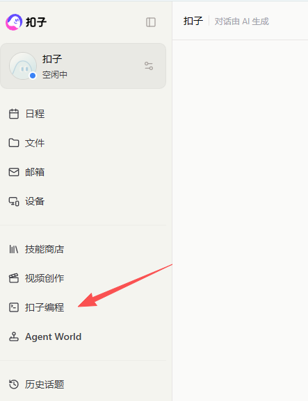
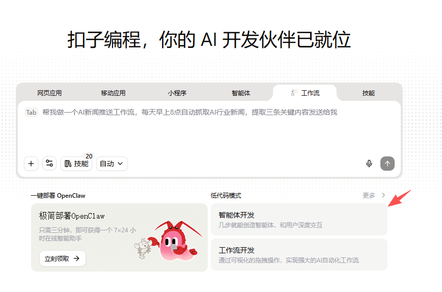
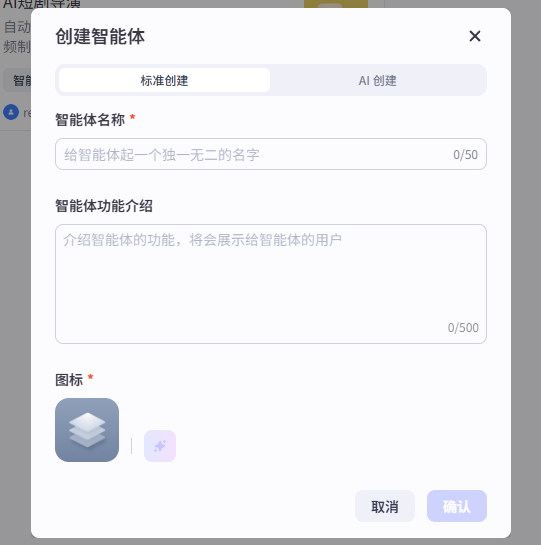
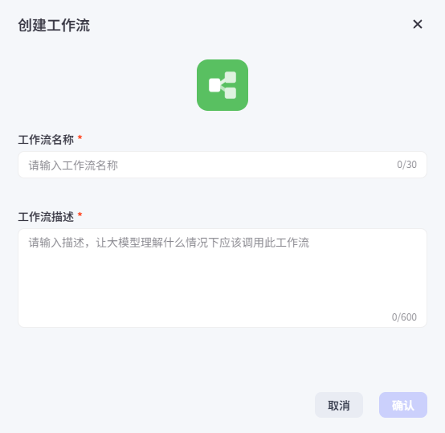
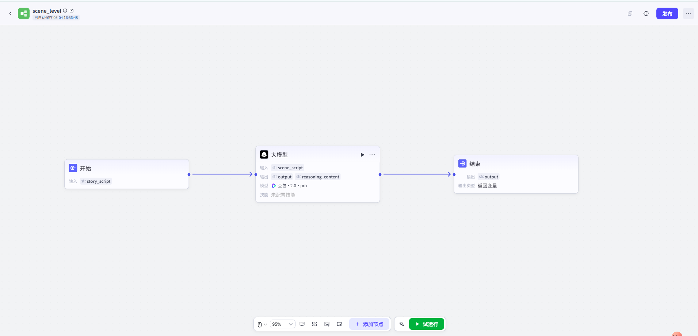

# 准备工作——注册扣子（coze）平台

我们可以直接搜索扣子（或coze）进入扣子的官网：https://www.coze.cn/

1. 点击扣子编程：

   

2. 选择智能体开发

   

3. 创建智能体，建议采用标准创建

   

4. 参考示例如下：

   

5. 人设和回复使用标准的即可。

6. 在技能处，点击添加工作流

   

7. 创建自己的工作流：

   

8. 界面示例如下：

   

至此，准备工作完成。