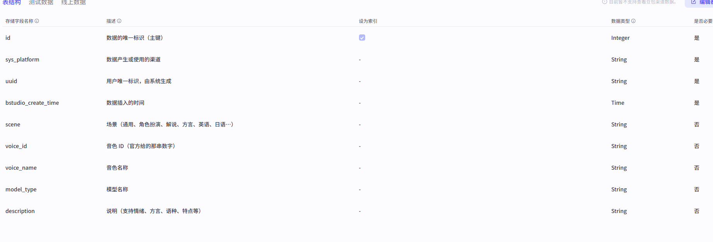
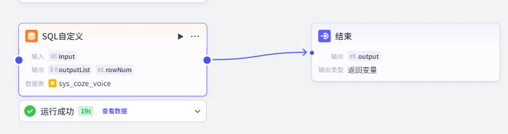
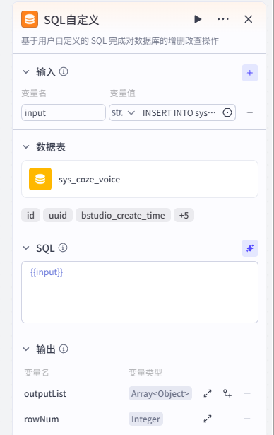

# 扣子语音包字典

实际地址：https://www.coze.cn/open/docs/dev_how_to_guides/sys_voice

本项目为了更好的让AI选择具体的音色。因此将网页的表格下载下来，进行持久化存储。

表结构如下：



插入方式：

利用扣子平台提供的SQL自定义组件实现。直接组件外接一个结束节点试运行即可：



input里面设置为string，将插入sql语句复制上去即可。参考：



插入SQL示例：

```sql
INSERT INTO sys_coze_voice (scene,voice_id,voice_name,model_type,description) VALUES
('通用场景','7620288417930297386','邻家女孩 2.0','豆包语音合成大模型 2.0','支持情绪、方言、语气、语速、音调调节'),
('通用场景','7566481398970712100','vivi','豆包语音合成大模型 2.0',''),
('通用场景','7568423452617506870','大壹','豆包语音合成大模型 2.0',''),
('通用场景','7568423452617523254','黑猫侦探社咪仔','豆包语音合成大模型 2.0',''),
('通用场景','7568423452617539638','鸡汤女','豆包语音合成大模型 2.0',''),
('通用场景','7568423452617556022','魅力女友','豆包语音合成大模型 2.0',''),
('通用场景','7568423452617572406','流畅女声','豆包语音合成大模型 2.0',''),
('通用场景','7568423452617588790','儒雅逸辰','豆包语音合成大模型 2.0',''),
('通用场景','7620302716920971318','温柔女神','豆包语音合成大模型 1.0',''),
('通用场景','7426720361732980745','少年梓辛','豆包语音合成大模型 1.0',''),
('通用场景','7426720361733144585','邻家女孩','豆包语音合成大模型 1.0',''),
('通用场景','7426720361733177353','渊博小叔','豆包语音合成大模型 1.0',''),
('通用场景','7426720361733193737','阳光青年','豆包语音合成大模型 1.0',''),
('通用场景','7426720361753903141','爽快思思','豆包语音合成大模型 1.0',''),
('通用场景','7426720361753952293','温暖阿虎','豆包语音合成大模型 1.0',''),
('通用场景','7426725529589596187','甜美小源','豆包语音合成大模型 1.0',''),
('通用场景','7426725529589612571','清澈梓梓','豆包语音合成大模型 1.0',''),
('通用场景','7426725529589645339','解说小明','豆包语音合成大模型 1.0',''),
('通用场景','7426725529589661723','开朗姐姐','豆包语音合成大模型 1.0',''),
('通用场景','7426725529589678107','邻家男孩','豆包语音合成大模型 1.0',''),
('通用场景','7426725529589694491','甜美悦悦','豆包语音合成大模型 1.0',''),
('通用场景','7426725529681657907','心灵鸡汤','豆包语音合成大模型 1.0',''),
('通用场景','7468512265134768179','灿灿','豆包语音合成大模型 1.0',''),
('通用场景','7468512265134899251','知性女声','豆包语音合成大模型 1.0',''),
('通用场景','7468512265134915635','清新女声','豆包语音合成大模型 1.0',''),
('通用场景','7468512265134981171','邻家小妹','豆包语音合成大模型 1.0',''),
('通用场景','7468512265151610907','清爽男大','豆包语音合成大模型 1.0',''),
('通用场景','7468512265151627291','贴心女声','豆包语音合成大模型 1.0',''),
('通用场景','7468518753626521637','知性温婉','豆包语音合成大模型 1.0',''),
('通用场景','7468518753626587173','暖心体贴','豆包语音合成大模型 1.0',''),
('通用场景','7468518753626619941','温柔文雅','豆包语音合成大模型 1.0',''),
('通用场景','7468518753626652709','开朗轻快','豆包语音合成大模型 1.0',''),
('通用场景','7468518753626701861','活泼爽朗','豆包语音合成大模型 1.0',''),
('通用场景','7468518846874288179','率真小伙','豆包语音合成大模型 1.0',''),
('通用场景','7481299960424562742','灿灿 2.0','豆包语音合成小模型',''),
('通用场景','7481299960424579126','炀炀','豆包语音合成小模型',''),
('通用场景','7481299960424595510','灿灿','豆包语音合成小模型',''),
('通用场景','7481299960424611894','通用女声','豆包语音合成小模型',''),
('通用场景','7481299960424628278','通用男声','豆包语音合成小模型',''),
('通用场景','7481299960424775734','亲切女声','豆包语音合成小模型',''),
('通用场景','7502012172269240359','懒音绵宝','豆包语音合成大模型 1.0',''),
('通用场景','7534613951015845929','暖阳女声','豆包语音合成大模型 1.0',''),
('通用场景','7539812934491619367','灵动欣欣','豆包语音合成大模型 1.0',''),
('通用场景','7539813339484913700','阳光洋洋','豆包语音合成大模型 1.0',''),
('通用场景','7539813339484946468','秀丽倩倩','豆包语音合成大模型 1.0',''),
('通用场景','7568478038065709075','Tina老师','豆包语音合成大模型 1.0',''),
('通用场景','7559804070903611431','元气甜妹','豆包语音合成大模型 1.0',''),
('角色扮演','7619304808578809919','撒娇学妹 2.0','豆包语音合成大模型 2.0','支持情绪、方言、语气、语速、音调调节'),
('角色扮演','7568423452617605174','可爱女生','豆包语音合成大模型 2.0',''),
('角色扮演','7568423452617621558','调皮公主','豆包语音合成大模型 2.0',''),
('角色扮演','7568423452617637942','爽朗少年','豆包语音合成大模型 2.0',''),
('角色扮演','7568423452617654326','天才同桌','豆包语音合成大模型 2.0',''),
('角色扮演','7568423452617670710','知性灿灿','豆包语音合成大模型 2.0',''),
('角色扮演','7426720361733013513','魅力女友','豆包语音合成大模型 1.0',''),
('角色扮演','7426720361733029897','深夜播客','豆包语音合成大模型 1.0',''),
('角色扮演','7426720361733046281','柔美女友','豆包语音合成大模型 1.0',''),
('角色扮演','7426720361733062665','撒娇学妹','豆包语音合成大模型 1.0',''),
('角色扮演','7426720361733160969','高冷御姐','豆包语音合成大模型 1.0',''),
('角色扮演','7426720361733210121','傲娇霸总','豆包语音合成大模型 1.0',''),
('角色扮演','7426725529589514267','病弱少女','豆包语音合成大模型 1.0',''),
('角色扮演','7426725529589530651','活泼女孩','豆包语音合成大模型 1.0',''),
('角色扮演','7426725529589547035','和蔼奶奶','豆包语音合成大模型 1.0',''),
('角色扮演','7426725529589563419','邻居阿姨','豆包语音合成大模型 1.0',''),
('角色扮演','7426725529589579803','温柔小雅','豆包语音合成大模型 1.0',''),
('角色扮演','7426725529589628955','东方浩然','豆包语音合成大模型 1.0',''),
('角色扮演','7468512265134817331','天才童声','豆包语音合成大模型 1.0',''),
('角色扮演','7468512265134833715','奶气萌娃','豆包语音合成大模型 1.0',''),
('角色扮演','7468512265134850099','猴哥','豆包语音合成大模型 1.0',''),
('角色扮演','7468512265134866483','熊二','豆包语音合成大模型 1.0',''),
('角色扮演','7468512265134882867','佩奇猪','豆包语音合成大模型 1.0',''),
('角色扮演','7468512265134948403','婆婆','豆包语音合成大模型 1.0',''),
('角色扮演','7468512265134964787','武则天','豆包语音合成大模型 1.0',''),
('角色扮演','7468512265151463451','少儿故事','豆包语音合成大模型 1.0',''),
('角色扮演','7468512265151479835','四郎','豆包语音合成大模型 1.0',''),
('角色扮演','7468512265151496219','顾姐','豆包语音合成大模型 1.0',''),
('角色扮演','7468512265151512603','樱桃丸子','豆包语音合成大模型 1.0',''),
('角色扮演','7468512265151660059','俏皮女声','豆包语音合成大模型 1.0',''),
('角色扮演','7468512265151676443','萌丫头','豆包语音合成大模型 1.0',''),
('角色扮演','7468518753626538021','绿茶小哥','豆包语音合成大模型 1.0',''),
('角色扮演','7468518753626554405','娇弱萝莉','豆包语音合成大模型 1.0',''),
('角色扮演','7468518753626570789','冷淡疏离','豆包语音合成大模型 1.0',''),
('角色扮演','7468518753626603557','憨厚敦实','豆包语音合成大模型 1.0',''),
('角色扮演','7468518753626636325','傲气凌人','豆包语音合成大模型 1.0',''),
('角色扮演','7468518753626669093','活泼刁蛮','豆包语音合成大模型 1.0',''),
('角色扮演','7468518753626685477','固执病娇','豆包语音合成大模型 1.0',''),
('角色扮演','7468518753626718245','撒娇粘人','豆包语音合成大模型 1.0',''),
('角色扮演','7468518753626734629','傲慢娇声','豆包语音合成大模型 1.0',''),
('角色扮演','7468518753626767397','潇洒随性','豆包语音合成大模型 1.0',''),
('角色扮演','7468518753626783781','腹黑公子','豆包语音合成大模型 1.0',''),
('角色扮演','7468518753626800165','儒雅才俊','豆包语音合成大模型 1.0',''),
('角色扮演','7468518846874255411','病娇白莲','豆包语音合成大模型 1.0',''),
('角色扮演','7468518846874271795','正直青年','豆包语音合成大模型 1.0',''),
('角色扮演','7468518846874304563','娇憨女王','豆包语音合成大模型 1.0',''),
('角色扮演','7468518846874320947','病娇萌妹','豆包语音合成大模型 1.0',''),
('角色扮演','7468518846874337331','青涩小生','豆包语音合成大模型 1.0',''),
('角色扮演','7468518846874353715','纯真学弟','豆包语音合成大模型 1.0',''),
('角色扮演','7468518846874370099','暖心学姐','豆包语音合成大模型 1.0',''),
('角色扮演','7468518846874386483','可爱女生','豆包语音合成大模型 1.0',''),
('角色扮演','7468518846874402867','成熟姐姐','豆包语音合成大模型 1.0',''),
('角色扮演','7468518846874419251','病娇姐姐','豆包语音合成大模型 1.0',''),
('角色扮演','7468518846874435635','优柔帮主','豆包语音合成大模型 1.0',''),
('角色扮演','7468518846874452019','优柔公子','豆包语音合成大模型 1.0',''),
('角色扮演','7468518846874468403','妩媚御姐','豆包语音合成大模型 1.0',''),
('角色扮演','7468518846874484787','调皮公主','豆包语音合成大模型 1.0',''),
('角色扮演','7468518846874501171','傲娇女友','豆包语音合成大模型 1.0',''),
('角色扮演','7468518846874517555','贴心男友','豆包语音合成大模型 1.0',''),
('角色扮演','7468518846874533939','少年将军','豆包语音合成大模型 1.0',''),
('角色扮演','7468518846874550323','贴心女友','豆包语音合成大模型 1.0',''),
('角色扮演','7468518846874566707','病娇哥哥','豆包语音合成大模型 1.0',''),
('角色扮演','7468518920446541862','学霸男同桌','豆包语音合成大模型 1.0',''),
('角色扮演','7468518920446558246','幽默叔叔','豆包语音合成大模型 1.0',''),
('角色扮演','7468518920446574630','性感御姐','豆包语音合成大模型 1.0',''),
('角色扮演','7468518920446591014','假小子','豆包语音合成大模型 1.0',''),
('角色扮演','7468518920446607398','冷峻上司','豆包语音合成大模型 1.0',''),
('角色扮演','7468518920446623782','温柔男同桌','豆包语音合成大模型 1.0',''),
('角色扮演','7468518920446640166','病娇弟弟','豆包语音合成大模型 1.0',''),
('角色扮演','7468518920446656550','幽默大爷','豆包语音合成大模型 1.0',''),
('角色扮演','7468518920446672934','傲慢少爷','豆包语音合成大模型 1.0',''),
('角色扮演','7468518920446689318','神秘法师','豆包语音合成大模型 1.0',''),
('角色扮演','7481299960424857654','奶气萌娃','豆包语音合成小模型',''),
('角色扮演','7481299960424874038','磁性男声','豆包语音合成小模型',''),
('角色扮演','7481299960428757031','知性姐姐-双语','豆包语音合成小模型',''),
('角色扮演','7481299960428773415','温柔小哥','豆包语音合成小模型',''),
('播报解说','7468512265134932019','悬疑解说','豆包语音合成大模型 1.0',''),
('播报解说','7468512265151528987','磁性解说男声','豆包语音合成大模型 1.0',''),
('播报解说','7468512265151561755','鸡汤妹妹','豆包语音合成大模型 1.0',''),
('播报解说','7468512265151594523','广告解说','豆包语音合成大模型 1.0',''),
('播报解说','7481299960424792118','说唱小哥','豆包语音合成小模型',''),
('播报解说','7481299960424808502','影视解说小美','豆包语音合成小模型',''),
('播报解说','7481299960424824886','阳光男声','豆包语音合成小模型',''),
('播报解说','7481299960424841270','活泼女声','豆包语音合成小模型',''),
('有声阅读','7468512265151709211','儒雅青年','豆包语音合成大模型 1.0',''),
('有声阅读','7468512265151725595','霸气青叔','豆包语音合成大模型 1.0',''),
('有声阅读','7468512265151741979','擎苍','豆包语音合成大模型 1.0',''),
('有声阅读','7468512265151758363','活力小哥','豆包语音合成大模型 1.0',''),
('有声阅读','7468518753626488869','古风少御','豆包语音合成大模型 1.0',''),
('有声阅读','7468518753626505253','温柔淑女','豆包语音合成大模型 1.0',''),
('有声阅读','7481299960424644662','擎苍','豆包语音合成小模型',''),
('有声阅读','7481299960424661046','阳光青年','豆包语音合成小模型',''),
('有声阅读','7481299960424677430','通用赘婿','豆包语音合成小模型',''),
('有声阅读','7481299960424693814','古风少御','豆包语音合成小模型',''),
('有声阅读','7481299960424710198','霸气青叔','豆包语音合成小模型',''),
('有声阅读','7481299960424726582','开朗青年','豆包语音合成小模型',''),
('有声阅读','7481299960424742966','甜宠少御','豆包语音合成小模型',''),
('有声阅读','7481299960424759350','儒雅青年','豆包语音合成小模型',''),
('趣味方言','7426720361732915209','湾区大叔','豆包语音合成大模型 1.0',''),
('趣味方言','7426720361732931593','呆萌川妹','豆包语音合成大模型 1.0',''),
('趣味方言','7426720361732947977','广州德哥','豆包语音合成大模型 1.0',''),
('趣味方言','7426720361732964361','北京小爷','豆包语音合成大模型 1.0',''),
('趣味方言','7426720361733079049','浩宇小哥','豆包语音合成大模型 1.0',''),
('趣味方言','7426720361733095433','广西远舟','豆包语音合成大模型 1.0',''),
('趣味方言','7426720361733111817','妹坨洁儿','豆包语音合成大模型 1.0',''),
('趣味方言','7426720361733128201','豫州子轩','豆包语音合成大模型 1.0',''),
('趣味方言','7426720361753870373','京腔侃爷','豆包语音合成大模型 1.0',''),
('趣味方言','7426720361753968677','湾湾小何','豆包语音合成大模型 1.0',''),
('趣味方言','7566932564049428534','粤语小溏','豆包语音合成大模型 1.0','方言-粤语-女生'),
('趣味方言','7481299960428855335','东北老铁','豆包语音合成小模型','方言-东北话'),
('趣味方言','7481299960428871719','广西表哥','豆包语音合成小模型','方言-广西话'),
('趣味方言','7481299960428888103','港剧男神','豆包语音合成小模型','方言-粤语'),
('趣味方言','7481299960428904487','广东女仔','豆包语音合成小模型','方言-粤语'),
('趣味方言','7481299960428920871','重庆小伙','豆包语音合成小模型','方言-川渝'),
('多情感音色','7524987545197756435','广州德哥（多情感）','豆包语音合成大模型 1.0','angry-生气、fear-恐惧、neutral-中性'),
('多情感音色','7524987545197772819','高冷御姐（多情感）','豆包语音合成大模型 1.0','happy、sad、angry、surprised、fear、hate、excited、coldness、neutral'),
('多情感音色','7524987545197789203','邻居阿姨（多情感）','豆包语音合成大模型 1.0','coldness、angry、surprised、neutral'),
('多情感音色','7524987545197805587','爽快思思（多情感）','豆包语音合成大模型 1.0','happy、sad、angry、surprised、excited、coldness、neutral'),
('多情感音色','7524987545197821971','柔美女友（多情感）','豆包语音合成大模型 1.0','happy、sad、angry、surprised、fear、hate、excited、coldness、neutral'),
('多情感音色','7524987545197838355','俊朗男友（多情感）','豆包语音合成大模型 1.0','happy、sad、angry、surprised、fear、neutral'),
('多情感音色','7524987545197854739','傲娇霸总（多情感）','豆包语音合成大模型 1.0','happy、angry、hate、neutral'),
('多情感音色','7524987545197871123','儒雅男友（多情感）','豆包语音合成大模型 1.0','happy、sad、angry、fear、excited、coldness、neutral'),
('多情感音色','7524987545197887507','甜心小美（多情感）','豆包语音合成大模型 1.0','sad、fear、hate、neutral'),
('多情感音色','7524987545197903891','阳光青年（多情感）','豆包语音合成大模型 1.0','happy、sad、angry、fear、excited、coldness、neutral'),
('多情感音色','7524987545197920275','魅力女友（多情感）','豆包语音合成大模型 1.0','sad、fear、neutral'),
('多情感音色','7524987545197936659','优柔公子（多情感）','豆包语音合成大模型 1.0','happy、sad、angry、fear、hate、excited、neutral'),
('多情感音色','7524987545197953043','京腔侃爷（多情感）','豆包语音合成大模型 1.0','happy、angry、surprised、hate、neutral'),
('多情感音色','7524987545197969427','北京小爷（多情感）','豆包语音合成大模型 1.0','angry、surprised、fear、excited、coldness、neutral'),
('英语音色','7426720361753935909','Alvin','豆包语音合成大模型 1.0','美式英语-男生'),
('英语音色','7426720361732997129','Brayan','豆包语音合成大模型 1.0','美式英语-男生'),
('英语音色','7426720361753919525','Skye','豆包语音合成大模型 1.0','美式英语-女生'),
('英语音色','7468512265134784563','Shiny','豆包语音合成大模型 1.0','美式英语-女生'),
('英语音色','7468512265151447067','Lily','豆包语音合成大模型 1.0','美式英语-女生'),
('英语音色','7468512265151643675','Candy','豆包语音合成大模型 1.0','美式英语-女生'),
('英语音色','7496857918554243113','Adam','豆包语音合成大模型 1.0','美式英语-女生'),
('英语音色','7496857918554259497','Sarah','豆包语音合成大模型 1.0','澳洲英语-女生'),
('英语音色','7496857918554275881','Dryw','豆包语音合成大模型 1.0','澳洲英语-男生'),
('英语音色','7496857918554292265','Smith','豆包语音合成大模型 1.0','英式英语-男生'),
('英语音色','7496857918554308649','Amanda','豆包语音合成大模型 1.0','美式英语-女生'),
('英语音色','7481299960428789799','活力女声-Ariana','豆包语音合成小模型','美式英语-女生'),
('英语音色','7481299960428806183','活力男声-Jackson','豆包语音合成小模型','美式英语-男生'),
('英语音色','7426720361753886757','Harmony','豆包语音合成大模型 1.0','美式英语-男生'),
('英语音色','7468512265134800947','Anna','豆包语音合成大模型 1.0','英式英语-女生'),
('英语音色','7468512265151545371','Morgan','豆包语音合成大模型 1.0','美式英语-男生'),
('英语音色','7468512265151578139','Hope','豆包语音合成大模型 1.0','美式英语-女生'),
('英语音色','7468512265151692827','Cutey','豆包语音合成大模型 1.0','美式英语-女生'),
('日语音色','7426720361754050597','あけみ（朱美）','豆包语音合成大模型 1.0','女生'),
('日语音色','7426720361754017829','かずね（和音）','豆包语音合成大模型 1.0','男生'),
('日语音色','7426720361753985061','はるこ（晴子）','豆包语音合成大模型 1.0','女生'),
('日语音色','7426720361754066981','ひろし（広志）','豆包语音合成大模型 1.0','男生'),
('日语音色','7481299960428822567','气质女声','豆包语音合成小模型','女生'),
('日语音色','7481299960428838951','日语男声','豆包语音合成小模型','男生'),
('西班牙语音色','7426720361754001445','Esmeralda','豆包语音合成大模型 1.0','女生'),
('西班牙语音色','7426720361754034213','Javier or Álvaro','豆包语音合成大模型 1.0','男生'),
('西班牙语音色','7426720361754083365','Roberto','豆包语音合成大模型 1.0','男生'),
('越南语音色','7542456603727888425','天才少女(越南语)','豆包语音合成小模型',''),
('泰语音色','7542456603728052265','天才少女(泰语)','豆包语音合成小模型','');
```

